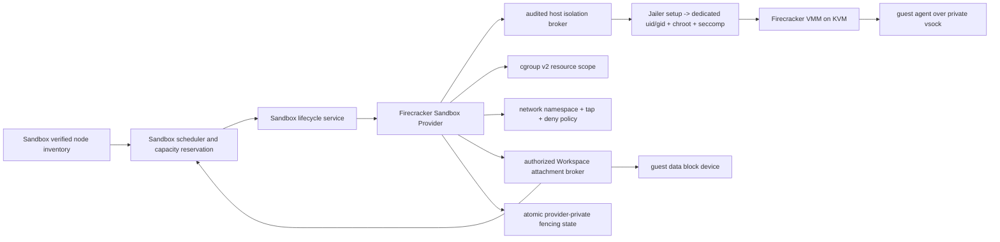

# ADR-20260729: Firecracker Provider Isolation And Node Boundaries

Status: accepted

Accepted: 2026-09-24 by the repository owner (structured implementation-gate decision, all listed reviewer roles).

Requirement: REQ-2026-0008

Owner: SDKWork Runtime Platform

Date: 2026-07-29

Specs: `ARCHITECTURE_DECISION_SPEC.md`, `APPLICATION_LAYERED_ARCHITECTURE_SPEC.md`, `COMPONENT_SPEC.md`, `SECURITY_SPEC.md`, `DEPLOYMENT_SPEC.md`, `RUNTIME_DIRECTORY_SPEC.md`, `OBSERVABILITY_SPEC.md`, `PERFORMANCE_SPEC.md`, `SUPPLY_CHAIN_SECURITY_SPEC.md`, `RUST_CODE_SPEC.md`, `TEST_SPEC.md`

## Context

Local Provider 只能承诺当前 OS User 边界，不能承载不可信多租户 SaaS Workload。Firecracker 能通过 KVM microVM、Jailer、Seccomp 与较小 VMM Attack Surface 提供更强边界，但仅启动 Firecracker Process 并不足以声明 `IsolationAssurance::MicroVm`。镜像完整性、Host 权限、cgroup、Network Namespace、Workspace Attachment、Control Channel、Fencing、Cleanup、Tenant Sanitization 与 Release Supply Chain 必须共同成立。

当前开发环境是 Windows，不能提供真实 KVM 证据。单元测试、Fake Host、配置渲染或 WSL Smoke 可以验证 Adapter 逻辑，但不能替代 Linux KVM Release Gate。

## Decision

1. 引入候选 L4 Adapter Component `sdkwork-sandbox-provider-firecracker`，实现既有 `SandboxProvider` Lifecycle Port，并在 `REQ-2026-0007` 获批后实现同一 `SandboxCommandExecutor`。Sandbox Service 与 Kernel 不增加 Firecracker 分支。
2. Provider Kind 固定为 `firecracker`，Assurance 固定为 `MicroVm`。Adapter 不允许配置提升/降低 Assurance；Preflight 不满足时 Provider 为 Degraded/Unavailable。
3. 首个受支持 Target 仅为 Linux KVM x86_64/aarch64 中经过 Release Matrix 验证的组合。Windows-native、macOS-native、WSL、无 KVM CI、Nested Virtualization 未经证明的节点不支持。
4. Firecracker、Jailer、Guest Kernel、RootFS、Guest Agent 和可选 Initrd 都是不可变 Release Inputs，并遵循 `ADR-20260729-sandbox-firecracker-artifact-compatibility-and-supply-chain` 的 `SandboxFirecrackerArtifactManifest`、明确 Version/Digest、Signature/SBOM/Provenance、Compatibility、Revocation 与 Rollback Gate。运行时禁止使用 `latest`、任意 URL 下载、Mutable Alias 或未校验本地文件。
5. Adapter 通过经过评审的外部 Firecracker/Jailer Process Contract 驱动 VMM，不复制 VMM、KVM 或 Jailer 源码，不手写 KVM ioctl，并保持本 Crate `unsafe_code = forbid`。
6. 每个 `SandboxRuntimeBindingId` 拥有独立、权限收紧的 Runtime Directory、Jailer Root、API Socket、cgroup v2 Scope、Network Namespace/Tap、Ephemeral RootFS Layer 与 Provider-private State。公共边界只使用 Opaque Sandbox Identity。
7. 普通 Adapter 以非特权身份运行。Jailer Root、cgroup、Network Namespace/Tap 与 Device 准备由经过审计的最小 Host Isolation Broker 执行；Broker 只接受固定操作、验证后的 Opaque Identity 和结构化 Limit，不接受任意 Shell、Executable 或 Host Path。准备完成后 Firecracker VMM 以专用非特权 UID/GID、最小 `/dev/kvm` Permission、Chroot、Seccomp 与显式 Resource Limit 运行。禁止 Root Firecracker、Ambient Capability、Host PID/Network Namespace、Host Device、Docker Socket、Cloud Credential 和不受限 Host Mount。
8. RootFS 默认只读。Authorized Workspace Attachment 遵循 `ADR-20260729-sandbox-workspace-block-device-attachment-and-sanitization`：Service Host 只依赖 provider-neutral `SandboxWorkspaceAttachmentPort`，L4 Broker/Adapter 将授权 Reference 解析为 encrypted Provider-private Guest Block Device；Workspace、Cache、Temp、RootFS 与 Secret-bearing Ephemeral Data 使用不同生命周期和 Limit。不得从 `sandbox_workspace_id` 推导 Host Path。
9. Guest Control 使用一次性启动身份绑定的私有 Vsock/等价 Channel。第一版只声明 Authenticated Guest Readiness，不声称 Guest Hardware/Remote Attestation；该 Guest Authentication 不替代 REQ-2026-0017 的 Host Node Machine Identity 与 Platform Attestation。Firecracker API Socket 仅存在于 Provider Runtime Directory，使用最小权限，不绑定 TCP，不挂载进 Guest/Workspace，不进入 Error/Log/Metric。
10. 每个 Allocation 的网络遵循 `ADR-20260729-sandbox-firecracker-network-isolation-and-egress-policy`：provider-neutral `SandboxNetworkPolicyPort` 是 Policy Authority，L4 `SandboxNetworkIsolationPort` 只执行机制；每个 Binding 独立 Network Namespace/Tap，默认 `DenyAll`，显式 DNS/Egress Grant 不能覆盖 Metadata、Host Control Plane 或 Tenant Lateral 永久拒绝。只有 Atomic Apply、Revision/Fingerprint Readback、Denial Probe 与 Residue Clear 成功后才 Network Ready。
11. Resource Enforcement 遵循 `ADR-20260729-sandbox-firecracker-resource-isolation-and-usage-facts`：provider-neutral `SandboxResourcePolicyPort` 签发 finite、capacity-backed Grant，L4 `SandboxResourceIsolationPort` 执行精确 Firecracker vCPU/Memory + per-binding cgroup v2 CPU/Memory/PID/IO；Readiness 回读 Effective Value 和 Process Membership，Release 前输出 Final Usage Fact，Metric 不作为 Billing Truth。
12. Cloud Placement 同时遵循 `ADR-20260729-sandbox-node-trust-enrollment-attestation-and-inventory` 与 `ADR-20260729-sandbox-multi-tenant-admission-scheduling-and-capacity-reservation`：Control Plane 先把短期 Machine Identity、Attestation、Artifact、Policy、Health、Lifecycle 与 Capacity Revision 绑定为 `SandboxVerifiedNodeInventoryRecord`，Scheduler 只能消费其 Projection；Admission Grant 与已确认 PostgreSQL Capacity Reservation 在 Provider Allocate 前完成，Placement Decision 绑定 Provider/Opaque Node/Binding/Fencing/Resource Vector。Provider 不拥有 Enrollment、Attestation Approval、Inventory Verification、Admission、Scheduler、Placement、Quota 或 Priority，且不得在失败时回退到 Local/Docker。
13. Provider-private State 原子持久记录 `sandbox_runtime_binding_id`、最高 `sandbox_fencing_token`、Artifact Digest、Policy Revision 与 Resource Identity。所有 Mutating Operation 在副作用前拒绝 Stale Token；Provider Process Restart 后仍保持该判断。
14. Stop 使用 Guest Graceful Shutdown 的有界窗口，超时后终止 VMM/Jailer。Destroy 幂等清理 Process、cgroup、Network Namespace、Tap、Socket、Ephemeral Disk、Control Channel 与 Secret Material，不删除 Agents-owned Workspace。
15. 第一版 Descriptor 在 REQ-2026-0014 获批、机制物化且真实 KVM Network Evidence 通过前不声明 Network；Snapshot、Restore、Warm Pool、Browser 与 Port Forward 仍需后续 Ready Requirement 和独立安全证据。Docker Provider 同样延期，不作为 Firecracker 失败回退。
16. `sandbox_provider_ready` 只有在 VMM、Guest Agent、Policy、Workspace、Resource Limit、Fencing 与 Artifact Integrity 全部 Ready 时为 true；任何失败都不得让 `SandboxSession` 进入 Running。

## Security And Runtime View

Host Path、API Socket、Tap、cgroup 与 microVM Identity 保持在 Adapter 下方；上层只看到 `Sandbox*` Opaque Identity、Capability、Assurance、Readiness 与安全 Outcome。

## Alternatives

### 在 Windows/WSL 上把配置测试视为 MicroVm 证据

拒绝。没有真实 Linux KVM/Jailer/cgroup/netns 执行就不能证明该 Assurance。

### 不使用 Jailer，直接以 Root 启动 Firecracker

拒绝。它扩大 Host Compromise 影响面，并使 Chroot、UID/GID、Seccomp 与 Resource Boundary 无法满足要求。

### 直接把 Host Workspace 目录传入 Guest

拒绝。它泄露 Host Path 并扩大 TOCTOU、Mount Escape 与 Tenant Residue 风险。Workspace 使用经过授权的 Provider-private Block Device Attachment。

### Firecracker 不可用时回退 Local 或 Docker

拒绝。Local 不满足 MicroVm Assurance；Docker 当前明确延期。不存在合规 Provider 时关闭失败。

### 第一版启用 Snapshot/Warm Pool

拒绝。Snapshot Compatibility、Secret/Memory Exclusion、Tenant Sanitization 与 Artifact Integrity 需要独立 Requirement 和 Release Evidence。

## Consequences

收益：SaaS 不可信 Workload 获得可验证的 MicroVm 路径；Kernel 保持 Provider-neutral；Fencing、Workspace Ownership 与 Command Contract 与 Local 一致；失败不会静默降低隔离。

成本：需要 IAM/Commerce Admission 输入、REQ-2026-0017 Node Agent/Machine Identity/PKI/Attestation/Verified Inventory、PostgreSQL Capacity Reservation、专用 Linux KVM 节点、固定镜像供应链、Guest Agent、Network/Workspace Broker、运维清理与安全测试；Windows 开发只能完成非 Assurance 单元测试；第一版不享受 Snapshot/Warm Pool 启动优化。

## Verification

- Unit/Contract Test 验证 Preflight、配置渲染、Digest/Path/Permission 拒绝、State/Fencing、API Socket Redaction 与 Cleanup Plan。
- 真实 Linux KVM Integration 启动固定 microVM，验证 Reservation-before-Allocate、Limit-not-above-Reservation、Guest Ready、Workspace Block Device、Command Conformance、cgroup Limit、Metadata/Egress Denial、Vsock Identity、Stale Fencing、VMM/Node Failure、Provider Restart、Capacity Recovery 与 Destroy Residue。
- Security Test 证明无 Root Firecracker、无 Host Network/PID、无 Docker Socket/Cloud Credential、无公共 Host Path/API Socket、无跨 Tenant Disk/Memory/Network/Terminal 残留。
- Release Evidence 遵循 `REQ-2026-0012`，固定 Firecracker/Jailer/Kernel/RootFS/Guest Agent/可选 Initrd 的精确 Manifest Digest 和 Architecture Tuple，包含 Signature、SBOM、Provenance、Checksum、License、Advisory、Known Limitation、Revocation、Rollout/Rollback、Node Drain 与 Vulnerability Response。
- 公共命名、MicroVm Assurance、Workspace/Network/Node 权限与生产发布必须完成人工架构、安全和运维评审。

## Supersedes / Superseded By

Supersedes: none.

Superseded by: none.
