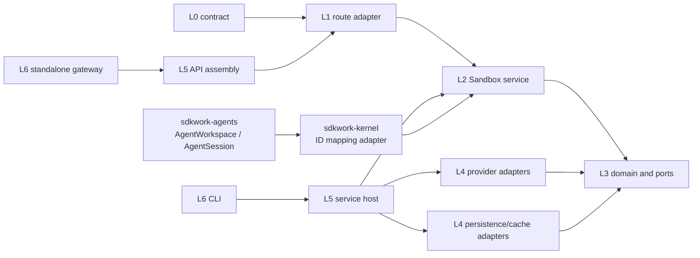

# SDKWork Sandbox 模块与契约架构

Status: draft

Owner: SDKWork Runtime Platform

Updated: 2026-09-23

Parent: [Technical Architecture](TECH_ARCHITECTURE.md)

## 1. Layer Model

| Layer | Sandbox Ownership | Dependency Rule |
| --- | --- | --- |
| L0 Contract | OpenAPI、RPC、Event Schema、State 与 Config Machine Contract | 不依赖实现。 |
| L1 Adapter | HTTP Route/Controller 与 Transport Mapper | 只调用 L2；不执行 Sandbox Provider/Repository Policy。 |
| L2 Service | `SandboxSession`、Workspace Runtime Transaction、Allocation、Checkpoint Handoff 与 Recovery Use Case | 只组合 L3 Port 与 Domain Type；不拥有 `AgentWorkspace`/`AgentSession`/Workspace Bytes。 |
| L3 Domain/Port | State Rule、Repository Port、Sandbox Provider SPI、Clock/ID/Secret/Event Port | 不导入 HTTP、Database、Sandbox Provider SDK、Deployment 或 UI Type。 |
| L4 Adapter | 优先 Local/Firecracker，后续 Docker/gVisor/Kubernetes/Remote Sandbox Provider，以及 Persistence/Cache Adapter | 实现 L3 Port；只拥有 Mechanism，不拥有 Business Policy。Docker 当前延期，不进入 Composition。 |
| L5 Composition | Service Host、Scheduler Composition、Sandbox Provider Registry、Config Bootstrap、API Assembly | 构造并绑定组件。 |
| L6 Delivery/Ops | CLI、Standalone Gateway、Node Agent、Deployment Package、Operator UI | 通过 L1/L5 或 Generated SDK 调用。 |

## 2. 当前已物化组件

The L0 event and observability contract candidate is authored under [`apis/async/`](../../../apis/async/), governed by `REQ-2026-0010` (`draft`), its proposed ADR, and the pending human review. It defines the Sandbox event envelope/catalog, transactional Outbox semantics, `SandboxAuditRecord`, structured logs, metrics, traces, backpressure, and fact separation; no event runtime, exporter, worker, migration, API, SDK, or deployment profile is implemented.

The L0 command contract candidate is authored under [`apis/commands/`](../../../apis/commands/), governed by `REQ-2026-0007` (`draft`), its proposed ADR, and the pending human review. It defines bounded logical executable identifiers/Argv, Provider-owned resolution without PATH/CWD lookup, Runtime-Binding-scoped immutable execution policy, protected environment input, fenced cancellation requests, portable logical paths, server-owned trace correlation, Service-derived/Executor-verified canonical fingerprints, Tenant+Provider idempotency, durable first-terminal arbitration, outcome-consistent binary-safe terminal results, explicit cleanup/quarantine, same-operation result-unavailable retry, pre-start/result-unavailable errors, and common conformance scenarios only; no Rust `SandboxCommandExecutor`, host process, or provider implementation is present.

| Crate | Layer Role | 当前 Contract |
| --- | --- | --- |
| `sdkwork-sandbox-provider-spi` | L3 `backend-domain` | `SandboxProvider`、`SandboxProviderAllocationRequest`、`SandboxProviderStartRequest`、`SandboxProviderStopRequest`、`SandboxProviderDestroyRequest`、Capability/Assurance 与 Sandbox-qualified Identity。 |
| `sdkwork-intelligence-sandbox-service` | L2 `backend-service` | `SandboxSessionLifecyclePort`、`SandboxSessionRepository`、`SandboxSessionState`、幂等和 Sandbox Provider Selection。 |
| `sdkwork-sandbox-provider-local` | L4 `backend-provider` | 无 Host Access；仅提供 `#[cfg(test)]` Fake Host Boundary 负向 Harness，预留 Local Adapter Ownership。 |
| `sdkwork-intelligence-sandbox-repository-memory` | L4 `backend-repository` | 非生产、单进程 `InMemorySandboxSessionRepository`。 |
| `sdkwork-intelligence-sandbox-repository-sqlx` | L4 `backend-repository` | PostgreSQL `SandboxSessionRepository`、受保护 Provider Allocation Reference、Tenant-scoped CAS 与 Lease/Fencing 候选实现。 |
| `sdkwork-sandbox-service-host` | L5 `runtime-service-host` | 无 Runtime Entrypoint；`REQ-2026-0009` draft 机器契约预留 typed Composition，并以跨契约 Profile/Capability Gate 关闭 Local、Cold Firecracker、Cloud Firecracker、Command/Terminal 和可选 Pool Readiness。 |
| `sdkwork-api-sandbox-assembly` | L5 `api-assembly` | 空 Route 装配骨架：`ROUTE_CRATE_COUNT: usize = 0` + `Router::new()`；持 assembly manifest 与组件契约，无已接受 Route。 |
| `sdkwork-sandbox-cli` | L6 `tooling` | Empty Executable；无已接受 Command。 |

## 2.1 REQ-2026-0002 候选组件契约

| Crate | Layer Role | Candidate Contract |
| --- | --- | --- |
| `sdkwork-sandbox-provider-spi` | L3 `backend-domain` | `SandboxProviderId`、`SandboxProviderKind`、`SandboxProviderDescriptor`、`SandboxProviderHealth`、`SandboxProviderAllocationRequest`/`SandboxProviderAllocation`、`SandboxProviderStartRequest`、`SandboxProviderStopRequest`、`SandboxProviderDestroyRequest`、`SandboxProviderReadiness`、`SandboxProvider` Port 与 `SandboxIdentifierError`。 |
| `sdkwork-intelligence-sandbox-service` | L2 `backend-service` | `SandboxSession`、`SandboxSessionState`、`CreateSandboxSessionCommand`、`SandboxSessionLifecycleCommand`、`SandboxSessionOperation`、Idempotency、Sandbox Provider Selection、`SandboxSessionRepository`/`SandboxSessionLifecyclePort` 与 `SandboxLifecycleError`/`SandboxSessionRepositoryError`。 |
| `sdkwork-intelligence-sandbox-repository-memory` | L4 `backend-repository` | Tenant-scoped、Versioned、Single-process `InMemorySandboxSessionRepository` Adapter。 |

以上公共命名是 `ADR-20260728-sandbox-lifecycle-provider-spi-and-memory-store` 的 `0.1` 候选契约，人工评审前不构成跨仓库稳定性承诺。

每个组件拥有 `README.md`、`specs/README.md` 与 `specs/component.spec.json`。空 Contract 是刻意设计：Public Type、Port、Dependency、Event、Config Key 和 Entrypoint 必须随可实施 Requirement 一起到达。

Local Provider 的 Fake Host Boundary 仅在测试配置中编译，验证 `.` Workspace Root、跨平台逻辑相对路径/Windows Device 拒绝、Logical Executable 语法先于 Allowlist、Typed Argv、Credential/Protected Environment Name 拒绝、NUL/CR/LF 和 UTF-8 Byte 边界；七项输入上限和 Protected Name 分别与 Command Contract/Request Schema 交叉校验。它没有公共导出、没有 Host I/O，不改变 Gate 0 对真实 Host Command 和 Local Capability 的禁止。

Local Host Boundary 当前由 repository-level `specs/sandbox-local-provider-host-boundary.contract.json` 作为集中候选权威，并被 Provider Delivery Gate 作为 Local Preflight 依赖。它固定 opened Runtime/Workspace Capability Handle 与请求 Identity 一致性、Runtime-Binding-scoped immutable Execution Policy、Provider-owned Logical Executable Registry、无 PATH/CWD Search、Protected Environment Denial、handle-relative no-follow/file-identity Filesystem、Windows suspended Job Object、Linux race-free delegated cgroup v2、macOS Terminal denial、Bounded Cleanup/Quarantine、Sensitive Observability 与 conditional Supply-chain Candidate；明确 String canonicalization/check-then-open、Process Group-only 和 spawn 后 attach 均不是安全保证。契约保持 `draft`、`implementationAuthorized: false`，不创建 Rust Port/Adapter、Host I/O、Process Spawn、Secret Resolver、Runtime Dependency、Config 或 Deployment Profile。

Firecracker Artifact Compatibility 当前只有 repository-level `specs/sandbox-firecracker-artifact-compatibility.contract.json`。它定义 draft `SandboxFirecrackerArtifactManifest`、精确 Architecture Tuple、Evidence、只读原子 Materialization、Revocation 与 Rollback；不创建 Rust Crate/Port、Artifact Builder/Downloader/Resolver、Runtime Path、Config、Release Artifact 或 `MicroVm` Assurance。

Workspace Block Device/Sanitization 当前只有 repository-level `specs/sandbox-workspace-block-device-attachment.contract.json`。Service Host 仍只注入 provider-neutral `SandboxWorkspaceAttachmentPort`；该契约定义其后的 draft L4 `SandboxWorkspaceBlockDevicePort` 机制、Agents/Drive-or-approved-storage Ownership、Grant、Fencing、At-rest Protection、Guest Device、Readiness、Sanitization、Residue 与 Quarantine；不创建 Rust Crate/Port、Storage Backend、KMS、Device/Mount、Runtime Path 或 `MicroVm` Assurance。

Service Host 机器契约位于 `crates/sdkwork-sandbox-service-host/specs/sandbox-service-host-{bootstrap,composition}.contract.json`。Bootstrap 契约固定八个 source profile、安全配置 allowlist、预打开 Runtime Directory、Secret/KMS、外部 Database Composition、Redis 禁用、有界 Telemetry 和逆序清理；Composition 契约把公共 Readiness 与 Profile/Capability 依赖分开，并把 Workspace Runtime Transaction 作为所有 Lane 的公共 Gate。Local、Standalone Firecracker、Cloud Firecracker 和 optional Pool 仍各自绑定其额外依赖；Standalone Data Residency/Recovery 只绑定 `sandbox_standalone_local`，且在 Firecracker Profiles 中明确禁止。Command/Terminal 必须同时具备 Descriptor、`SandboxCommandExecutor` 与 Conformance。全部 18 个关联契约当前均未授权，因此该依赖图只是 Gate 0 证据。

Firecracker Network Isolation 当前只有 repository-level `specs/sandbox-firecracker-network-isolation.contract.json`。provider-neutral `SandboxNetworkPolicyPort` 是候选 Policy Authority，其后的 L4 `SandboxNetworkIsolationPort` 只消费签名 Grant，并通过 Host Broker 固定 `sandbox_prepare_network` 机制执行；契约定义 `DenyAll`、显式 DNS/Egress、永久 Metadata/Host/Tenant Lateral Denial、per-binding netns/Tap、Fencing/Revision、Atomic Apply/Verify、Readiness、Cleanup/Residue/Quarantine 与 Durable Audit，不创建 Rust Crate/Port、Network Namespace、Tap、Firewall/DNS/Route Runtime、Config 或 `MicroVm` Assurance。

Firecracker Resource Isolation 当前只有 repository-level `specs/sandbox-firecracker-resource-isolation.contract.json`。provider-neutral `SandboxResourcePolicyPort` 是候选 Quota/Resource Policy Authority，其后的 L4 `SandboxResourceIsolationPort` 只消费 `SandboxResourceLimitGrant`，通过 Host Broker 固定 `sandbox_apply_resource_limits` 执行 Firecracker Machine Config + per-binding cgroup v2，并输出 immutable `SandboxResourceUsageFact`；契约定义 CPU/Memory/PID/IO、Fencing/Revision、Effective Readback、typed Limit Outcome、Final Usage、Commerce Ownership、Cleanup/Residue/Quarantine，不创建 Rust Crate/Port、Quota Engine、cgroup/Machine Config Runtime、Usage Pipeline、Commerce Adapter、Config 或 `MicroVm` Assurance。

Multi-tenant Admission、Scheduler、Placement 与 Capacity 当前只有 repository-level `specs/sandbox-multi-tenant-scheduling.contract.json`。候选 `SandboxAdmissionPolicyPort` 原子预留 Tenant Quota，`SandboxNodeInventoryPort` 提供受信且有界的 Node Snapshot，`SandboxSchedulerPort` 先执行 Hard Placement Filter，`SandboxCapacityReservationPort` 再在 PostgreSQL 权威边界完成 Reservation-before-Allocate；`SandboxPlacementDecision` 与 REQ-2026-0015 Resource Grant 绑定同一 Admission/Reservation。该 Gate 0 不创建 Rust Crate/Port、Scheduler/Admission Runtime、Database Schema/Migration、Node Agent/Enrollment、Pool、Commerce Adapter、Config 或 Deployment Profile。

PostgreSQL Quota/Capacity Persistence 当前只有 repository-level `specs/sandbox-quota-and-capacity-persistence.contract.json`。REQ-2026-0018 将候选权威拆为 `SandboxTenantQuotaState`、`SandboxAdmissionReservation`、`SandboxNodeCapacityState` 与 `SandboxCapacityReservation`，固定显式 Resource Vector、全局 Lock Order、CAS/Fencing、Database Clock、Bounded Whole-transaction Retry、TTL/Quarantine、Keyset Reconciliation、RLS/Role 与 PITR/RPO/RTO。该 Gate 明确把现有 `TenantId`/`tenant_id TEXT` 到标准 SQL Subject `BIGINT` 的对齐列为实现前 Migration Blocker；当前 Database Contract/Registry/Migration 和 Rust Repository 不变，不创建 Table、Port、Adapter、Scheduler 或 Deployment Profile。

Cloud Node Trust、Enrollment、Attestation 与 Verified Inventory 当前只有 repository-level `specs/sandbox-node-trust-and-inventory.contract.json`。四个 provider-neutral L3 Port 分别拥有 Enrollment、Attestation Verification、Inventory Publication 与 Lifecycle Control；Node Agent 只作为 Claimant/Publisher，Control Plane 绑定短期 Key-bound Identity、Attestation、Artifact、Policy、Health 与 Capacity Revision 后签发 `SandboxVerifiedNodeInventoryRecord`，REQ-2026-0016 的 `SandboxNodeInventoryPort` 只能投影该记录。该 Gate 0 不创建 Rust Crate/Port、Node Agent、PKI/CA/HSM、Attestation Verifier、Database、Scheduler/Provider Runtime、Service Unit 或 Deployment Profile。

Lifecycle History/Idempotency Retention 当前只有 repository-level `specs/sandbox-lifecycle-history-and-idempotency.contract.json`。REQ-2026-0020 将当前有界历史 hydrate（读取上限 `MAX_SANDBOX_SESSION_OPERATIONS`，超限失败关闭）的后续目标拆为 bounded `SandboxSessionHotState` 和 separate point-lookup `SandboxLifecycleIdempotencyRecord`，固定 current-operation-only read、Fingerprint Replay/Conflict、active record non-expiry、bounded cleanup 与 expand/backfill/cutover Gate；精确限制、保留值、物理命名、Migration、公开 Error 和 Kernel Mapping 未获人审，不改变现有 Service/Memory/SQLx Component Contract 或数据库资产。

Workspace Runtime Transaction 当前只有 repository-level `specs/sandbox-workspace-runtime-transaction.contract.json`。REQ-2026-0021 在 L2 编排现有窄 Port，固定 Local/Firecracker Lane、Workspace Revision Writer Lease、Admission/Capacity/Pool、Attachment/Command、Durable Checkpoint/Handoff、Agents CAS Promotion、Failure Compensation、Sanitization/Residue/Release 和 bounded Backpressure。它不创建 Catch-all Crate，不拥有 Workspace Business Model/Bytes，也不授权 Runtime、Storage/KMS、API/SDK 或跨仓库实现。

Standalone Data Residency/Recovery 当前只有 repository-level `specs/sandbox-standalone-data-residency.contract.json`。REQ-2026-0022 不是新的 L2 Service 或 Store，而是 `sandbox_standalone_local` 的 Release Evidence Composition：它固定 11 类数据的单一 Owner/Persistence Role，区分 authoritative-server PostgreSQL 与显式 `client-local` SQLite，分离 Workspace/Service Data/Runtime/Cache/Log/Secret/Temp Capability，默认拒绝 Remote Copy/Sync/Backup/Telemetry，并要求角色正确的 Backup/Restore、Export/Purge、故障关闭和四仓真实 OS/Network/Residue Evidence。它不创建 Crate、Table、Migration、Runtime Path、Backup、Telemetry、Sync、API/SDK、Installer 或跨仓库实现。

## 3. 输入 PRD Module Mapping

| 输入逻辑模块 | SDKWork-aligned Ownership | 计划 Artifact（仅在拆分合理时） |
| --- | --- | --- |
| `sandbox-core` | L3 Shared Domain Type/Port，不建立 Application-code `core` Catch-all | 扩展 Focused Port/Domain Crate；不创建 `sdkwork-sandbox-core`。 |
| `sandbox-runtime` | Kernel-facing Runtime Port 与 L2 Orchestration | `SandboxSessionLifecyclePort`、`CreateSandboxSessionCommand`、`SandboxSessionLifecycleCommand` 与 `SandboxRuntimeBinding`；不创建 Bare Runtime Crate。 |
| `sandbox-api` | L0 internal-api Authority、L1 Route、L5 Assembly、L6 Listener | `sdkwork-routes-sandbox-internal-api`、`sdkwork-api-sandbox-assembly`、`sdkwork-api-sandbox-standalone-gateway`。 |
| `sandbox-session` | L2 Lifecycle Use Case 与 L3 State/Repository Port | `SandboxSession`/`SandboxSessionState` 是 `AgentSession` 的运行投影；使用 `sandbox_session_id`、`sandbox_session_state` 与 `sandbox_operation_id`，位于 Sandbox Service。 |
| `sandbox-workspace` | Workspace Attachment、Runtime Transaction 与受控运行访问 | Agents 拥有 Identity/Revision/Conflict/Promotion；Drive/批准 Volume 拥有 Bytes/Candidate；Sandbox 只拥有一次 Binding 的 Projection、Writer Fencing、Checkpoint Handoff 和 Compensation，具体 Backend 需独立 Ready Requirement。 |
| `sandbox-local-data-residency` | Local-only Release Evidence Composition，不建立 Data Service 或 Catch-all Store | REQ-2026-0022 组合 BirdCoder/Agents/Kernel/Sandbox/Workspace/Database/Secret/Backup Owner Evidence；不复制业务表，不改变数据库角色，不从 `standalone` 或 Provider 推导驻留。 |
| `sandbox-scheduler` | L2 Admission/Placement Orchestration、L3 Admission/Inventory/Scheduler/Capacity Port、L4 PostgreSQL Quota/Capacity Persistence Adapter | REQ-2026-0016 与 REQ-2026-0018 已形成 draft Gate 0 Contract；Subject Migration、公共命名、四对象数据权威与实现仍等待人工评审，不创建 Scheduling Service/Table/Migration/Adapter。 |
| `sandbox-node-trust` | L3 Enrollment/Attestation/Inventory Publication/Lifecycle Port、未来 L4 Machine Identity/Attestation/Verified Inventory Adapter 与 L6 Node Agent | REQ-2026-0017 已形成 draft Gate 0 Contract；Node Agent 不是 Scheduler Authority，公共命名、PKI、Attestation、Database 与 Deployment 实现均等待人工评审。 |
| `sandbox-pool` | Prepared/Warm Pool、跨 Tenant Reuse、Sanitization、Refresh、Drain 与 Capacity Reconciliation | REQ-2026-0019、ADR-20260730 与 `specs/sandbox-runtime-pool.contract.json` 已形成 draft Gate 0；实现、Snapshot、Persistence、Worker、API/SDK 与 Deployment 仍等待独立人工评审和真实 KVM Evidence，不能从 Scheduler Gate 推导。 |
| `sandbox-provider` | L3 SPI 与 L4 Adapter | 现有 SPI Scaffold；未来 `sdkwork-sandbox-provider-{local,firecracker,docker,gvisor,kubernetes,remote}`，其中 Docker 延期；Firecracker 只消费经评审的 `SandboxFirecrackerArtifactManifest`，不拥有构建/发布。 |
| cache/network/security/filesystem/terminal/log/event/snapshot/config | 正确 Layer 中的 Cross-cutting Policy、Port 与 Adapter | 仅在 Reuse 或 Complexity 形成真实 Component Boundary 时拆 Crate。 |
| `sandbox-monitor` | Health/Metric/Trace Adapter 与 Operator Projection | Observability Adapter 或 Operator API，而不是 Business Service。 |
| `sandbox-cli` | L6 Command Adapter | 现有 Empty CLI Scaffold。 |

## 4. 计划依赖图



箭头表示 Build/Use Dependency 指向被消费组件。跨仓库方向固定为 `sdkwork-agents -> sdkwork-kernel -> sdkwork-sandbox`。L2 不导入 Concrete Provider；Provider Adapter 不决定 Lifecycle 或 Tenant Policy；CLI 与 Route 不直接访问 Provider 或 Repository；Sandbox 不导入 Agents 模型。

**当前落地状态**（2026-09-23 核对，依据各 crate `Cargo.toml`；F-08 要求计划与现状可区分）：已落地 2 条——`SERVICE → PORTS`（`sdkwork-intelligence-sandbox-service` 依赖 `sdkwork-sandbox-provider-spi`）与 `STORES → PORTS`（`…-repository-memory`/`…-repository-sqlx` 依赖 `…-sandbox-service` 与 `…-provider-spi`）。其余边均为计划、零落地：`API → ROUTE → SERVICE`（无 route crate）、`HOST → SERVICE/PROVIDERS/STORES`（service-host 零依赖）、`ASSEMBLY → ROUTE`（assembly 仅依赖 web-bootstrap/core）、`GATEWAY → ASSEMBLY`、`CLI → HOST`（cli 零依赖）、`AGENTS → KERNEL → SERVICE`（跨仓，未接线）。

## 5. Repository Layout

```text
sdkwork-sandbox/
  AGENTS.md
  Cargo.toml
  .sdkwork/
  apis/                         # reviewed and draft contract authority boundary
  apps/README.md                # repository root is primary app surface
  crates/
    sdkwork-sandbox-provider-spi/
    sdkwork-intelligence-sandbox-service/
    sdkwork-sandbox-provider-local/
    sdkwork-intelligence-sandbox-repository-memory/
    sdkwork-intelligence-sandbox-repository-sqlx/
    sdkwork-sandbox-service-host/
    sdkwork-api-sandbox-assembly/
    sdkwork-sandbox-cli/
  sdks/                         # inactive generated SDK family boundary
  database/                     # active authoritative-server PostgreSQL contract and migration assets
  jobs/ tools/ plugins/ examples/
  etc/ deployments/ scripts/   # inactive runtime/release boundaries
  docs/
  specs/                        # active cross-component machine contracts
  tests/                        # active cross-component contract verification
```

## 6. Agents、Kernel 与 Sandbox Integration Boundary

Sandbox 不依赖具体 Agent Provider，也不复制 Kernel Tool Semantics 或 Agents 业务模型。进程内集成权威已经固定为 Sandbox-owned Rust Port：

1. `sdkwork-agents` 授权 `AgentWorkspace`/`AgentSession` 并调用 `sdkwork-kernel`。
2. Kernel 映射为 `SandboxWorkspaceId`/`SandboxSessionId`，构造 `CreateSandboxSessionCommand` 或 `SandboxSessionLifecycleCommand`；字段使用 `sandbox_workspace_id`、`sandbox_session_id`、`sandbox_operation_id`、`sandbox_required_capabilities` 与 `sandbox_minimum_assurance`。
3. Kernel 只消费 `SandboxSessionLifecyclePort`，并把 `SandboxRuntimeBindingId` 映射为 Agents 的 Opaque `runtimeLocationId`。
4. Kernel 将 `SandboxLifecycleError::LeaseUnavailable`/`SandboxLifecycleError::LeaseLost` 显式映射为来源为 Runtime 的可重试 Conflict；持久化与保护器内部错误不泄露为 Provider 或 Validation Error。
5. Sandbox 不反向依赖 Kernel/Agents，不创建 Workspace Registry，不推导 Physical Path。

BirdCoder 位于业务调用链上游，通过生成的 Agents App SDK 选择已批准的 Local/Cloud 产品能力。它只可持久化声明为 `client-local` 的有界设备偏好和 Opaque Mount Identity，不拥有 Workspace/Project/Session/Turn/Task/Revision/Runtime Binding/Pool Claim 表，也不通过 Raw HTTP、手工 Auth Header、Shell String 或 Host Path 绕过 Agents/Kernel/Sandbox 权威。

未来跨进程组合可通过生成的 `@sdkwork/intelligence-internal-sdk` 或经过评审的 Internal RPC SDK，但每个 Operation 只能有一个 Source Contract Authority。HTTP/RPC 若并存，必须共享 Operation Semantics、Lifecycle、Identifier、Authorization 与 Error。Sibling Cargo 依赖只在 Kernel Root Cargo 声明一次，member crate 使用 `.workspace = true`。
