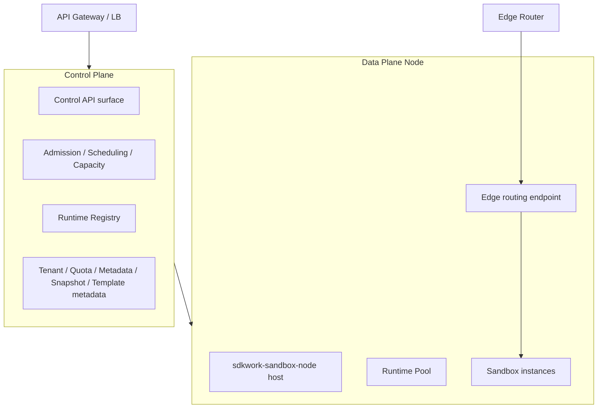

# Sandbox 运行后端、Runtime Pool 与状态物化实现结构

Status: active

Owner: SDKWork Runtime Platform

Updated: 2026-09-22

Parent: [SDKWork Sandbox Technical Architecture](TECH_ARCHITECTURE.md)

Specs: `ARCHITECTURE_DECISION_SPEC.md`, `APPLICATION_LAYERED_ARCHITECTURE_SPEC.md`, `COMPONENT_SPEC.md`, `CODE_STYLE_SPEC.md`, `NAMING_SPEC.md`, `RUST_CODE_SPEC.md`, `SECURITY_SPEC.md`, `PRIVACY_SPEC.md`, `DATABASE_SPEC.md`, `DATABASE_FRAMEWORK_SPEC.md`, `CACHE_SPEC.md`, `RUNTIME_DIRECTORY_SPEC.md`, `DEPLOYMENT_SPEC.md`, `SDK_SPEC.md`, `SUPPLY_CHAIN_SECURITY_SPEC.md`

本分片描述“Sandbox 如何被承载”的技术结构与边界。产品要求见 [PRD-runtime-execution-model.md](../../product/prd/PRD-runtime-execution-model.md)。本分片只描述结构与门禁，不构成任何实现授权。

## 1. 后端抽象

产品需要一个“运行后端”抽象，使上层 Agent 契约不随底层技术变化。它的语义边界是：创建、启动、暂停、恢复、派生、快照与销毁。

本仓库**不引入新的 `sdkwork-sandbox-backend` 一类组件**。该抽象已经由现有边界分工承担，且把全部生命周期与可选能力塞进单一 Trait 会违反组件职责单一原则：

| 抽象职责 | 本仓承载 | 说明 |
| --- | --- | --- |
| Allocate / Start / Stop / Destroy / Health / Capability Discovery | `SandboxProvider`（`sdkwork-sandbox-provider-spi`） | 已有候选契约与 SPI 边界 |
| Command / Terminal 执行 | 共享 `SandboxCommandExecutor` 候选端口 | 见 [REQ-2026-0007](../../product/requirements/REQ-2026-0007-sandbox-command-execution-contract.md) |
| Pause / Resume | Provider 能力 + Workspace Runtime Transaction 组合 | 见 [REQ-2026-0021](../../product/requirements/REQ-2026-0021-sandbox-workspace-runtime-transaction-and-checkpoint.md) |
| Snapshot / Restore | 独立 Snapshot 端口（尚未定义） | 需独立 `REQ-*` 与 ADR |
| Fork | 独立派生端口（尚未定义） | 需独立 `REQ-*` 与 ADR |
| Workspace 设备挂载 | L4 `SandboxWorkspaceBlockDevicePort` | 见 [REQ-2026-0013](../../product/requirements/REQ-2026-0013-sandbox-workspace-block-device-attachment-and-sanitization.md) |
| Network / Resource 隔离 | L4 `SandboxNetworkIsolationPort` / `SandboxResourceIsolationPort` | 见 [REQ-2026-0014](../../product/requirements/REQ-2026-0014-sandbox-firecracker-network-isolation.md)、[REQ-2026-0015](../../product/requirements/REQ-2026-0015-sandbox-firecracker-resource-isolation-and-usage.md) |

规则：可选能力通过独立端口组合，不得全部并入 Lifecycle Trait。上层（Kernel）只消费 Provider-neutral 端口，不按具体后端写业务分支。

## 2. 运行模式分层的实现路径

产品定义三级运行模式。技术实现上它们由“Provider + 隔离机制 + 所需 Assurance”三者共同决定，不新增平行枚举语义（`IsolationAssurance` 是 SDKWork 共享类型）。

| 运行模式 | 隔离机制 | 对应 Provider 形态 | `IsolationAssurance` | 状态 |
| --- | --- | --- | --- | --- |
| Mode 0 Shared Execution Runtime | 无独立内核边界；逻辑隔离 + 共享运行时 | 尚不存在 | **需要新增取值**（当前枚举无弱于 `Container` 的项） | 未批准 |
| Mode 1 Namespace Sandbox | Mount/PID/Network Namespace、Cgroup v2、Seccomp、Capabilities、OverlayFS | 尚不存在（Local Provider 只承诺宿主机用户边界） | `Container` | 未批准 |
| Mode 2 MicroVM Sandbox | Firecracker + KVM + Guest | `sdkwork-sandbox-provider-firecracker`（计划） | `MicroVm` | Gate 0 候选 |
| （未来）User-space Kernel | 用户态内核 | gVisor Provider（后续） | `UserSpaceKernel` | 后续 |
| （未来）专用虚拟机 | 独立 VM | Remote VM Provider（后续） | `DedicatedVm` | 后续 |
| 本地可信场景 | 宿主机用户边界 | `sdkwork-sandbox-provider-local` | `HostUser` | 候选边界 |

引入 Mode 0 需要同时完成：`IsolationAssurance` 共享类型变更 ADR、跨租户残留与信息泄露 Threat Model、独立 Capability 矩阵，以及“禁止作为降级回退路径”的负向测试。在这三项完成前不得实现。

## 3. Control Plane 与 Data Plane 分离

架构规则：控制面不执行 Agent 任务，数据面不拥有跨租户业务权威，**Sandbox 流量不经过控制面**。



- 控制面拥有：租户、用户、授权、配额、Sandbox 元数据、Placement、生命周期编排、Snapshot 元数据、Template 元数据、计量、指标元数据。
- 控制面决定工作负载放到哪个节点；节点决定如何运行；Sandbox 流量直达节点，不经控制面。
- 控制面的推荐持久化组合：PostgreSQL（权威元数据）、Redis 或批准的分布式适配器（协调与热点状态）、对象存储（制品与快照）、列式分析存储（可选，用于指标与审计分析）。具体选型必须服从 `DATABASE_SPEC.md`、`CACHE_SPEC.md` 与 `RUNTIME_DIRECTORY_SPEC.md`。
- 节点内部职责区域（**括号内为允许的命名形态**）：

| 职责区域 | 允许的落地形态 |
| --- | --- |
| 节点宿主与注册 | `sdkwork-sandbox-node`（可执行宿主） |
| 准入与调度客户端 | `sdkwork-sandbox-scheduler`（计划） |
| Runtime Pool | 已由 `REQ-2026-0019` 固定为 `SandboxRuntimePool`/`SandboxPoolSlot`/`SandboxPoolClaim` 语义 |
| 进程 / 文件系统 / 网络 / 资源 / 快照 / 模板缓存 / 存储 / 指标 / Agent 网关 | 各自独立端口与适配器；**禁止**使用 `*-manager`、`*-core`、`*-runtime`、`*-backend` 这类通用后缀组件名 |

`NAMING_SPEC.md` 第 3 节与 `CODE_STYLE_SPEC.md` 明确禁止为新增组件使用通用应用代码后缀。任何按“职责区域清单”直接推导出的组件命名都必须先转换为职责形状（例如“存储管理”应表达为具体的 repository/storage 适配器职责，而不是 `storage-manager`）。

## 4. Runtime Pool 结构

Pool 的产品语义已在 [PRD-runtime-execution-model.md](../../product/prd/PRD-runtime-execution-model.md) 第 3 节与 [REQ-2026-0019](../../product/requirements/REQ-2026-0019-sandbox-runtime-pool-and-fast-allocation.md) 固定。实现结构要点：

- 槽位类型分两级：tenant-neutral 的 `PreparedSlot`（可信节点、不可变制品、运行目录身份与可预备宿主资源已验证）与另行取证的 `WarmMicroVmSlot`。
- 分配链固定顺序：Admission Reservation → Verified Node Inventory → Capacity Reservation → Pool Claim → Provider Allocation → Workspace/Network/Resource Grant → Running Ready。任一环节缺失或状态不确定即失败关闭。
- 槽位状态至少区分 `Preparing`、`Ready`、`Claiming`、`Claimed`、`Sanitizing`、`Quarantined`、`Retired`；非法转换确定性失败。
- 补池与回收必须使用有界批量、Lease/Fencing、数据库时间与至少一次幂等；禁止进程内内存作为云端权威、无界扫描或按 TTL 猜测释放已占用容量。
- Pool 是可选的加速路径，**不得**阻塞冷启动路径，也不得绕过 Workspace Runtime Transaction。

## 5. Template 物化链

```text
Object Storage（权威制品）
      │
      ▼
Template Registry（版本与兼容性元数据）
      │
      ▼
Node Cache（Hot / Warm / Cold，LRU/LFU/TTL + 容量上限）
      │
      ▼
Sandbox（只读共享层）
```

- Docker 或 Dockerfile **只能作为构建输入格式**；运行时链路中不得出现容器运行时依赖，也不得用容器作为隔离边界。
- Template 必须与 Firecracker 制品元组分层：制品元组（VMM、Jailer、Guest Kernel、RootFS、Guest Agent、可选初始化盘）固定二进制与镜像完整性，Template 在其上声明运行时与应用层内容。二者不得互相替代。
- Template 内容的签名、SBOM、Provenance、License、Advisory、原子物化、吊销与回滚继承 [REQ-2026-0012](../../product/requirements/REQ-2026-0012-sandbox-firecracker-artifact-compatibility-and-supply-chain.md) 的门禁。
- 对等获取：同 Template 已存在于邻近节点时优先节点间获取，回源对象存储为次优路径。
- Template 缓存命中不得成为正确性前提；缓存清空后功能必须等价可用，只是更慢。

## 6. Snapshot 实现结构

```text
Running Sandbox
      │
    Pause
      │
      ├── Guest Memory 快照
      ├── VM / 虚拟硬件状态
      └── RootFS 差异（脏块）
              │
              ▼
        Object Storage
```

要求：

- 快照元数据必须显式记录兼容性条件：运行版本、内核版本、Template 版本、快照版本、架构与 CPU 特性。任一维度不一致时拒绝恢复。
- 恢复必须校验完整性校验值、签名、版本与兼容性；同时确认独占所有权与 Secret 新鲜度。
- 跨租户恢复永久禁止；快照必须绑定租户。
- 按需内存加载（lazy memory）使用缺页中断驱动的按需加载路径；热点页画像用于恢复时后台预取，不得影响语义正确性。
- 恢复路径与冷启动路径共享同一生命周期与状态机语义；不允许 Snapshot 恢复出现独立的状态机。

## 7. COW RootFS 与可写层

```text
Template RootFS（只读，可共享）
        +
Sandbox 可写层（独立）
        ↓
OverlayFS 或等价的写时复制机制
```

- 未修改数据不复制；只有实际写入的数据落入可写层。
- 暂停时允许把脏块导出为差异数据；该差异与 Workspace Revision 是两个不同概念，不得互相替代。
- 可写层生命周期与 Sandbox 生命周期绑定；销毁时必须清理或显式保留，且不得隐式影响 Template。
- 可写层与 Workspace 持久数据必须是不同的存储对象与不同的权威。

## 8. 存储分层

| 级别 | 位置 | 内容 | 访问顺序 |
| --- | --- | --- | --- |
| L1 | 本地 NVMe | 活跃 Template、可写层、热数据 | 第一优先 |
| L2 | 节点共享 / 对等缓存 | 可复用 Template 与制品 | 第二优先 |
| L3 | 对象存储（S3 兼容） | Template 权威、Snapshot、冷数据 | 回源 |

- 对象存储必须兼容 S3 协议族，允许对接主流对象存储服务；具体提供方属于部署配置，不属于架构常量。
- 存储区域与数据驻留必须遵循 `REQ-2026-0026` 的 `regionCode`/`providerRegion`/`storageRegion`/`availabilityZone` 分层；禁止把数据写到未声明区域。
- 缓存与存储都遵循 `CACHE_SPEC.md` 的命名空间与失效规则，并遵守 `RUNTIME_DIRECTORY_SPEC.md` 的目录矩阵。

## 9. 节点生命周期

每个节点宿主必须支持：注册 → 能力上报 → 心跳与资源上报，并在上报中携带 CPU、内存、磁盘、网络、加速器、NUMA 拓扑、内核能力与虚拟化能力。

- 节点信任、注册、认证与已验证清单继承 [REQ-2026-0017](../../product/requirements/REQ-2026-0017-sandbox-node-trust-enrollment-attestation-and-inventory.md) 的门禁。
- Drain：节点进入 DRAINING 后禁止新分配、允许既有 Sandbox 继续运行，并支持经暂停、快照与迁移后停机。
- 节点准入阈值（继续创建前必须满足的负载上限）必须可配置且可观测；超阈值时由 Scheduler 选择其他节点，而不是继续在同一节点超卖。
- 节点崩溃后由控制面检测并尝试在具备兼容性的其他节点恢复；恢复不得为同一 Binding 产生两个活动所有者。

## 10. 部署形态

| 形态 | 范围 | 边界 |
| --- | --- | --- |
| 单机模式 | 开发、测试、个人部署、边缘 | API、Scheduler、Runtime 与 Sandbox 在同一进程/主机组合；不得声称多租户容量能力 |
| 集群模式 | 控制面 + 多数据面节点 | 控制面多副本；节点 N+1；Placement 由控制面决策 |
| Kubernetes | 仅承载控制面与节点宿主生命周期 | **禁止**把 Pod 等价为 Sandbox；Pod 内运行节点宿主，Sandbox 在宿主之下 |
| 裸金属 / 虚拟机 | 生产推荐 | 需要虚拟化能力与 NVMe；具体硬件基线由 Benchmark 定义 |

控制面必须支持多副本、元数据数据库高可用、协调服务集群与对象存储高可用。具体拓扑与命名遵循 `DEPLOYMENT_SPEC.md`、`APPLICATION_GATEWAY_SPEC.md` 与 `API_ASSEMBLY_SPEC.md`。

## 11. 数据模型与权威归属

产品对象清单必须映射到明确的权威归属，禁止 Sandbox 建立第二套业务权威：

| 对象类别 | 权威 | 说明 |
| --- | --- | --- |
| 租户、用户、权限 | IAM | Sandbox 只消费已验证上下文 |
| Agent Workspace、Agent Session | `sdkwork-agents` | Sandbox 不持久化其业务记录 |
| `SandboxSession`、`SandboxSessionOperation`、`SandboxRuntimeBinding` | Sandbox | PostgreSQL 为服务权威 |
| Provider 私有分配上下文 | Provider（加密持久化） | 不得进入公共投影、日志、事件或 Wire |
| 租户配额状态、准入预约、节点容量状态、容量预约 | Sandbox（PostgreSQL） | 见 [REQ-2026-0018](../../product/requirements/REQ-2026-0018-sandbox-postgresql-quota-and-capacity-reservation-persistence.md) |
| Runtime 槽位与认领 | Sandbox | 见 [REQ-2026-0019](../../product/requirements/REQ-2026-0019-sandbox-runtime-pool-and-fast-allocation.md) |
| Template 与制品元数据 | Sandbox / 供应链权威 | 见 [REQ-2026-0012](../../product/requirements/REQ-2026-0012-sandbox-firecracker-artifact-compatibility-and-supply-chain.md) |
| Snapshot、Workspace Revision、Checkpoint | 分层：Sandbox / Agents / Drive 或批准的 Volume Authority | 三种产物三种权威，禁止合并 |
| 计量事实 | Sandbox 产出，Commerce 消费 | Sandbox 不拥有价格、账单与支付 |
| 事件与审计 | Sandbox（Outbox） | 见 [REQ-2026-0010](../../product/requirements/REQ-2026-0010-sandbox-observability-event-audit-outbox.md) |

对象命名必须使用 `Sandbox*` 前缀或 SDKWork 共享类型；`tenant_id` 保持平台共享 SQL Subject 名称。表结构、命名与迁移遵循 `DATABASE_SPEC.md` 与 `DATABASE_FRAMEWORK_SPEC.md`，且必须先完成 `SUBJECT_ID_SPEC.md` 要求的标识归一化（见 [REQ-2026-0018](../../product/requirements/REQ-2026-0018-sandbox-postgresql-quota-and-capacity-reservation-persistence.md) 的预发布迁移门禁）。

## 12. 命名与门禁

本分片引用的能力清单**不构成组件清单**。落地时必须满足：

- 组件名表达职责（service、repository-sqlx、routes、service-host、native-host、worker、assembly、gateway、provider-*），禁止通用后缀。
- 禁止引入 `sdkwork-sandbox-core`、`sdkwork-sandbox-runtime`、`sdkwork-sandbox-manager`、`sdkwork-sandbox-backend`、`sdkwork-sandbox-orchestrator` 一类组件。
- 每个新组件都必须有 `specs/component.spec.json` 机器契约并通过组件端口检查。
- 校验命令：

```bash
node ../sdkwork-specs/tools/check-rust-crate-naming-standard.mjs --root .
node ../sdkwork-specs/tools/check-component-port-bindings.mjs --root .
node ../sdkwork-specs/tools/check-application-layering.mjs --root .
node ../sdkwork-specs/tools/check-identity-naming.mjs --root .
```

本分片描述的后端、Pool、Template、Snapshot、COW、按需内存、存储分层、节点生命周期与部署形态中，除已有 Gate 0 候选契约外，**没有任何一项获得实现授权**。
