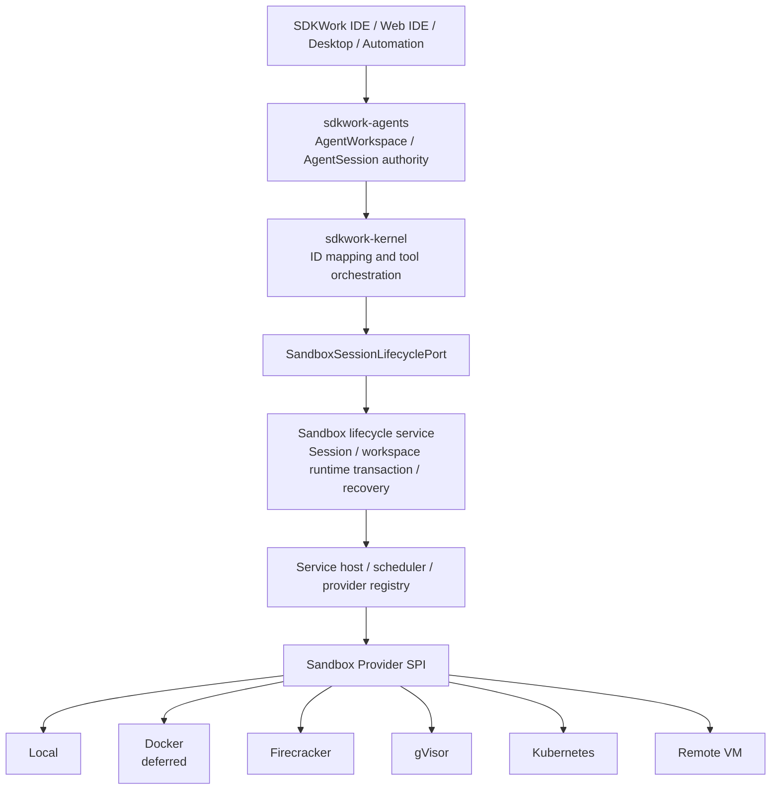

# SDKWork Sandbox Technical Architecture

Status: active

Owner: SDKWork Runtime Platform

Updated: 2026-09-22

Specs: `ARCHITECTURE_DECISION_SPEC.md`, `DOCUMENTATION_SPEC.md`, `APPLICATION_LAYERED_ARCHITECTURE_SPEC.md`, `COMPONENT_SPEC.md`, `CODE_STYLE_SPEC.md`, `NAMING_SPEC.md`, `API_SPEC.md`, `INTERNAL_API_SPEC.md`, `SECURITY_SPEC.md`, `PRIVACY_SPEC.md`, `DATABASE_SPEC.md`, `DATABASE_FRAMEWORK_SPEC.md`, `RUNTIME_DIRECTORY_SPEC.md`, `DEPLOYMENT_SPEC.md`, `PERFORMANCE_SPEC.md`, `SUPPLY_CHAIN_SECURITY_SPEC.md`, `OBSERVABILITY_SPEC.md`

## 文档地图 (Document Map)

- [模块、Layer、Contract 与目录布局](TECH-modules-and-contracts.md)
- [Local、Remote 与 SaaS Runtime Topology](TECH-runtime-topology.md)
- [Security、Resource Governance、Recovery 与 Observability](TECH-security-and-operations.md)
- [运行后端、Runtime Pool 与状态物化实现结构](TECH-runtime-backends-and-pools.md)
- [性能设计与容量验证](TECH-performance-and-capacity.md)
- [性能与宿主能力实测基线](TECH-performance-baseline.md)
- [平台支持与宿主能力](TECH-platform-support.md)
- [E2B 能力对齐审计](TECH-e2b-capability-parity.md)
- [Proposed Baseline ADR](../decisions/ADR-20260728-runtime-boundary-and-rust-workspace.md)
- [Proposed Lifecycle ADR](../decisions/ADR-20260728-sandbox-lifecycle-provider-spi-and-memory-store.md)
- [Proposed Local Provider Assurance ADR](../decisions/ADR-20260728-local-provider-assurance-and-host-boundaries.md)
- [Proposed Agents Workspace And Sandbox Attachment ADR](../decisions/ADR-20260728-agents-workspace-and-sandbox-attachment-ownership.md)
- [Proposed PostgreSQL Lifecycle Persistence And Reconciliation ADR](../decisions/ADR-20260728-postgresql-sandbox-lifecycle-persistence-and-reconciliation.md)
- [Proposed Sandbox Provider Allocation Key Rotation ADR](../decisions/ADR-20260728-sandbox-provider-allocation-key-rotation-and-reencryption.md)
- [Proposed Sandbox Command Execution And Terminal ADR](../decisions/ADR-20260729-sandbox-command-execution-and-terminal-boundary.md)
- [Proposed Firecracker Provider Isolation ADR](../decisions/ADR-20260729-firecracker-provider-isolation-and-node-boundaries.md)
- [Proposed Service Host Composition And Readiness ADR](../decisions/ADR-20260729-sandbox-service-host-composition-and-readiness.md)
- [Proposed Sandbox Observability, Event, Audit And Outbox ADR](../decisions/ADR-20260729-sandbox-observability-event-audit-outbox-boundary.md)
- [Proposed Sandbox Host Isolation Broker ADR](../decisions/ADR-20260729-sandbox-host-isolation-broker-boundary.md)
- [Proposed Sandbox Firecracker Artifact Compatibility And Supply Chain ADR](../decisions/ADR-20260729-sandbox-firecracker-artifact-compatibility-and-supply-chain.md)
- [Proposed Sandbox Workspace Block Device Attachment And Sanitization ADR](../decisions/ADR-20260729-sandbox-workspace-block-device-attachment-and-sanitization.md)
- [Proposed Sandbox Firecracker Network Isolation And Egress Policy ADR](../decisions/ADR-20260729-sandbox-firecracker-network-isolation-and-egress-policy.md)
- [Proposed Sandbox Firecracker Resource Isolation And Usage Facts ADR](../decisions/ADR-20260729-sandbox-firecracker-resource-isolation-and-usage-facts.md)
- [Proposed Sandbox Multi-tenant Admission, Scheduling And Capacity Reservation ADR](../decisions/ADR-20260729-sandbox-multi-tenant-admission-scheduling-and-capacity-reservation.md)
- [Proposed Sandbox Node Trust, Enrollment, Attestation And Verified Inventory ADR](../decisions/ADR-20260729-sandbox-node-trust-enrollment-attestation-and-inventory.md)
- [Proposed Sandbox PostgreSQL Quota And Capacity Reservation Persistence ADR](../decisions/ADR-20260729-sandbox-postgresql-quota-and-capacity-reservation-persistence.md)
- [Proposed Sandbox Workspace Runtime Transaction And Checkpoint ADR](../decisions/ADR-20260730-sandbox-workspace-runtime-transaction-and-checkpoint.md)
- [Proposed Sandbox Standalone Data Residency And Recovery ADR](../decisions/ADR-20260730-sandbox-standalone-data-residency-and-recovery.md)

## 1. 架构总览 (Architecture Overview)

SDKWork Sandbox 划分为 Provider-neutral Control Plane 与 Provider-specific Execution Data Plane。`sdkwork-agents` 拥有 `AgentWorkspace` 与 `AgentSession` 业务权威，`sdkwork-kernel` 将已授权身份映射为 `SandboxWorkspaceId` 与 `SandboxSessionId`，再通过 `SandboxSessionLifecyclePort` 请求 Runtime Capability 和 Sandbox Session Lifecycle Outcome。Kernel 不选择 Container、microVM、Cluster 或 Host Implementation；Sandbox Service 校验运行策略与状态，Scheduler/Composition 选择合规 Provider，Adapter 再操作具体基础设施。



稳定架构规则是：产品生命周期与安全策略位于 Sandbox Provider Mechanism 之上；Sandbox Provider 私有身份与 Host Detail 必须停留在 SPI 之下。

## 2. 技术选型 (Technology Choices)

| 关注点 | 选择 | 状态与原因 |
| --- | --- | --- |
| 主语言 | Rust 2021 Cargo Workspace | Phase 0 已启用；与 `sdkwork-kernel` 及 SDKWork Rust Service 约定一致。 |
| Async Execution | Tokio Multi-thread Runtime | Operational Async Work 开始时引入；版本只在 Root Cargo 集中声明。 |
| HTTP | `sdkwork-web-framework` Rust Crate 与标准 Axum Binding | internal-api 获批后引入；禁止 Local Framework Fork 与 Raw Listener Composition。 |
| HTTP Contract | SDKWork v3 internal-api | 计划 Authority 为 `sdkwork-intelligence-internal-api`，锁定 `/internal/v3/api/intelligence/sandbox/*`，Ingress Token Auth，生成 Internal SDK。 |
| 内部服务传输 | 优先进程内 Rust Port；仅在跨进程需求成立时引入 RPC | HTTP/RPC 若并存，Operation Semantics 必须一致。 |
| Metadata Persistence | Authoritative Sandbox Lifecycle Metadata 使用 PostgreSQL、SDKWork Database Framework 与 `sdkwork-intelligence-sandbox-repository-sqlx`；Memory Repository 仅用于测试/候选验证 | PostgreSQL Adapter 与 Database Assets 已物化，并通过临时 PostgreSQL 17 Migration/Repository/Concurrency/Recovery/Query-plan/Backup-Restore 候选验证；多副本长稳、PITR、SLO 与生产运维证据仍是 Release Gate。生产 SaaS/Server 不使用 SQLite 作为权威库。 |
| Distributed Coordination | Cloud Shared Cache、Lease、Rate Limit 与 Coordination-critical State 使用 Redis 或批准的 Distributed Adapter | 计划项；Process-local 仅限测试与明确 Single-process Standalone。 |
| Event | 版本化 Event Schema，尽可能对齐 CloudEvents Concept | `apis/async/` 已有 REQ-2026-0010 draft Event/Outbox/Audit/Observability 候选契约；Terminal Stream 不等同 Durable Domain Event。 |
| Observability | Structured `tracing`、Metric、Trace Propagation 与 Append-oriented Audit | 已有 draft Envelope/Event/Outbox/Audit/Observability Catalog 与 Contract Test；运行时 Exporter、Audit Store 和 Outbox Worker 仍未获批。 |
| Sandbox Provider Packaging | Native Host Process、OCI Container、microVM Image、Kubernetes Workload 或 Enrolled Remote Agent | 各 Sandbox Provider 明确 Capability 与 Assurance，不隐藏差异。 |
| Local Host Boundary | opened Capability Handle + handle-relative Filesystem + platform-specific Process Supervisor | REQ-2026-0003 draft 机器契约固定 Windows suspended Job Object、Linux race-free delegated cgroup v2、macOS Terminal denial、空环境 allowlist 与 Cleanup/Quarantine；不创建 Port、Host I/O、Process Spawn、Secret Injection 或 Runtime Dependency。 |
| Firecracker Artifact Integrity | Architecture-specific immutable Firecracker/Jailer/Guest Kernel/RootFS/Guest Agent Tuple | REQ-2026-0012 draft `SandboxFirecrackerArtifactManifest` 只固定 Compatibility/Evidence/Materialization/Revocation/Rollback Gate，不发布或下载 Artifact。 |
| Workspace Guest Device | Agents/Drive-or-approved-storage owned data -> Sandbox Runtime Projection -> Firecracker Guest Block Device | REQ-2026-0013 draft `SandboxWorkspaceBlockDevicePort` 固定 Grant/Fencing/Encryption/Readiness/Sanitization/Residue/Quarantine；不创建 Storage/KMS/Device Runtime。 |
| Firecracker Network Isolation | provider-neutral `SandboxNetworkPolicyPort` -> signed Grant -> L4 `SandboxNetworkIsolationPort` -> Host Broker | REQ-2026-0014 固定 `DenyAll`、显式 DNS/Egress、永久拒绝、per-binding netns/Tap、Atomic Apply/Verify、Cleanup/Quarantine 与 Durable Audit；不创建 Network Runtime。 |
| Firecracker Resource Isolation | provider-neutral `SandboxResourcePolicyPort` -> signed Limit Grant -> L4 `SandboxResourceIsolationPort` -> Host Broker -> immutable Usage Fact | REQ-2026-0015 固定 Firecracker Shape + per-binding cgroup v2 CPU/Memory/PID/IO、Effective Readback、Final Usage、Commerce Ownership、Cleanup/Quarantine；不创建 Resource/Quota/Billing Runtime。 |
| Multi-tenant Admission、Scheduler And Capacity | IAM/Commerce verified input -> `SandboxAdmissionPolicyPort` -> `SandboxNodeInventoryPort` -> `SandboxSchedulerPort` -> PostgreSQL `SandboxCapacityReservationPort` -> immutable Placement | REQ-2026-0016 固定 Atomic Tenant Admission、可信 Node Snapshot、Hard Placement Filter、Tenant-aware Fairness、Reservation-before-Allocate、Resource Grant Binding、Fencing 与 Orphan Recovery；不创建 Scheduler/Admission/Database/Node Agent/Pool/Commerce Runtime。 |
| Cloud Node Trust And Verified Inventory | single-use Bootstrap Reference -> `SandboxNodeEnrollmentPort` -> key-bound short-lived Machine Identity -> TLS 1.3 mutual authentication -> `SandboxNodeAttestationVerificationPort` + `SandboxNodeInventoryPublicationPort` -> Control-plane `SandboxVerifiedNodeInventoryRecord` -> `SandboxNodeInventoryPort` | REQ-2026-0017 分离 Machine Authentication 与 Platform Attestation，并固定 Rotation/Revocation、Drain/Quarantine、Freshness、Revision/Sequence/CAS 和 Scheduler Verified Projection Gate；不创建 Node Agent、PKI/CA/HSM、Verifier、Database、Scheduler/Provider Runtime 或 Deployment Profile。 |
| PostgreSQL Quota And Capacity Persistence | external verified Policy/Inventory -> `SandboxTenantQuotaState` + `SandboxAdmissionReservation` + `SandboxNodeCapacityState` + `SandboxCapacityReservation` -> Lifecycle/Provider | REQ-2026-0018 固定显式 Resource Vector、全局 Lock Order、CAS/Fencing、Database Clock、TTL/Quarantine、RLS/Role、PITR/RPO/RTO 及 `tenant_id TEXT` 到标准 `BIGINT` 的预发布迁移门禁；不创建 Table/Migration/Repository/Scheduler Runtime。 |
| Standalone Local Data Residency And Recovery | four-repository data inventory -> role-correct local stores -> separate capabilities -> transfer/backup/purge evidence -> Local readiness | REQ-2026-0022 仅为 `sandbox_standalone_local` 固定 `device-local-persistence`/`strict-device-local-processing` 候选声明、PostgreSQL Server 与 `client-local` SQLite 角色分离、无隐式传输、恢复和真实 OS Evidence；不创建 Database、Runtime Path、Backup、Telemetry、Sync、API/SDK 或跨仓库实现。 |
| Sandbox 运行后端抽象 | 不新增单一 Backend Trait；Allocate/Start/Stop/Destroy/Health/Capability Discovery 由 `SandboxProvider` SPI 承担，Pause/Resume 由 Workspace Runtime Transaction 组合，Snapshot/Fork/Port/Network/Resource 各为独立端口 | 把全部生命周期与可选能力塞进一个 Trait 会违反组件职责单一原则；禁止引入 `sdkwork-sandbox-backend` 一类通用后缀组件。详见 [TECH-runtime-backends-and-pools.md](TECH-runtime-backends-and-pools.md) 第 1 节。 |
| 运行模式分层 | Shared Execution Runtime / Namespace Sandbox / MicroVM Sandbox 三级，由 Provider 形态 + 隔离机制 + `IsolationAssurance` 共同表达 | 复用 SDKWork 共享类型 `IsolationAssurance`，不新建平行枚举语义；最轻一级弱于现有任何取值，需共享类型变更 ADR 与跨租户残留 Threat Model。详见同名分片第 2 节。 |
| Runtime Pool | tenant-neutral `PreparedSlot` -> 经真实 KVM/身份轮换/设备重绑定/残留证据后的 `WarmMicroVmSlot` | 已由 REQ-2026-0019 固定 Claim/Fencing/Sanitization/Quarantine 语义；Pool 是可选的加速路径，不得阻塞冷启动，也不得绕过 Workspace Runtime Transaction。 |
| Template 物化链 | Object Storage（权威）-> Template Registry -> Node Cache（Hot/Warm/Cold）-> Sandbox 只读共享层 | Docker/Dockerfile 只允许作为构建输入格式，禁止成为运行时依赖或隔离边界；Template 与 Firecracker 制品元组分层，不得互相替代。 |
| Snapshot 与按需内存 | Guest Memory + VM/Hardware State + RootFS Diff -> Object Storage；恢复时缺页驱动按需加载 + 热点页预取 | Snapshot 元数据必须显式记录运行版本、内核、Template、架构与 CPU 特性；不兼容或跨租户一律拒绝恢复，Provider Snapshot 不得成为唯一持久事实。 |
| COW RootFS | Template RootFS 只读共享 + Sandbox 独立可写层（OverlayFS 或等价机制） | 未修改数据不复制；可写层生命周期与 Sandbox 绑定，且与 Workspace 持久数据是不同权威。 |
| 存储分层与对等缓存 | L1 本地 NVMe -> L2 节点共享/对等缓存 -> L3 S3 兼容对象存储 | 存储区域必须遵循 REQ-2026-0026 的 `regionCode`/`providerRegion`/`storageRegion` 分层；缓存是派生数据，不得成为唯一事实源。 |
| 边缘路由与端口暴露 | 统一边缘入口 -> 数据面节点 -> Sandbox 内监听端口 | 外部端点由服务端生成且不可猜测；禁止暴露 Provider 私有地址、节点地址或宿主端口，也禁止绕过控制面直连节点。端口暴露能力当前无 `REQ-*`。 |
| Sandbox 内 Agent 运行时 | Sandbox 内受控代理组件，经 Sandbox 内通道（Unix Domain Socket / Vsock 或等价机制）对外暴露进程、文件、终端、端口、环境、MCP 与 Skills 执行代理 | 不得成为公共 API 权威，不得访问 Control Plane 数据库，高频数据流不得经控制面，供应链完整性纳入 REQ-2026-0012 元组。当前无实现授权。 |
| 节点宿主与 Drain | `sdkwork-sandbox-node` 宿主：注册、能力上报、心跳、资源上报、DRAINING 后禁止新分配并允许既有实例运行 | Node Trust/Verified Inventory 继承 REQ-2026-0017；节点准入阈值必须可配置可观测，超阈值时换节点而不是超卖。 |
| 性能与容量约束 | 零拷贝优先、不阻塞异步运行时、异步 I/O 基准后选用、内存与连接池化、高频路径避免全局锁、调度 `O(log n)`、资源不足背压排队、租户加权公平 | 全部目标数值都是工程目标；未完成参考硬件测量前不得作为发布门禁。禁止通过增加线程数解决并发、增加容器数解决隔离。详见 [TECH-performance-and-capacity.md](TECH-performance-and-capacity.md)。 |

本表中的计划选择不会自动成为依赖。只有 Ready Requirement 与实际消费组件存在时，依赖才能进入 Build Authority。

## 3. 系统边界与模块 (System Boundaries And Modules)

当前已物化七个 Rust Crate，其中 Provider SPI、Lifecycle Service、Memory Repository 与 PostgreSQL Repository 已提供候选实现；Local 只有 Fake Host Boundary，Service Host 与 CLI 未激活。Command、Firecracker、Broker、Artifact、Workspace Device、Network/Resource、Scheduling/Capacity、Node Trust、Quota Persistence、Runtime Pool、Lifecycle Hot State、Workspace Runtime Transaction 与 Standalone Data Residency 均只有独立 REQ/ADR/机器契约，没有获批的公共 Port/Component、Storage/KMS、Node Agent、数据库 Schema 或 Runtime。REQ-2026-0021 只在服务层组合运行事务积木；REQ-2026-0022 只组合 Local Evidence，不成为新的数据权威。Agents 保留业务/Revision 权威，Workspace/Drive 保留 Bytes 权威，Sandbox 只拥有 Transaction、Lifecycle 与清理事实。详见 [TECH-modules-and-contracts.md](TECH-modules-and-contracts.md)。输入 PRD 的 `Runtime / Session / Workspace / Sandbox / Provider / Scheduler / Pool / Placement / Quota` 术语保持不变；实现标识使用以下唯一映射：

| 架构关注点 | Canonical Type/Port | Canonical Rust 字段/变量 | 预留 Wire 映射 |
| --- | --- | --- | --- |
| Workspace Context | `SandboxWorkspaceId` | `sandbox_workspace_id` | `sandboxWorkspaceId` |
| Session Identity/State | `SandboxSessionId`、`SandboxSession`、`SandboxSessionState` | `sandbox_session_id`、`sandbox_session`、`sandbox_session_state` | `sandboxSessionId`、`sandboxSessionState` |
| Runtime Binding | `SandboxRuntimeBindingId`、`SandboxRuntimeBinding` | `sandbox_runtime_binding_id`、`sandbox_runtime_binding` | `sandboxRuntimeBindingId` |
| Sandbox Allocation | `SandboxId` | `sandbox_id` | `sandboxId` |
| Provider Contract | `SandboxProvider`、`SandboxProviderId`、`SandboxProviderKind`、`SandboxProviderDescriptor` | `sandbox_provider`、`sandbox_provider_id`、`sandbox_provider_kind`、`sandbox_provider_descriptor` | `sandboxProviderId`、`sandboxProviderKind` |
| Lifecycle Operation | `OperationId`、`SandboxSessionOperation` | `sandbox_operation_id`、`sandbox_session_operation` | `sandboxOperationId` |
| Lifecycle Ownership | `SandboxLeaseOwnerId`、`SandboxFencingToken`、`SandboxSessionLease` | `sandbox_lease_owner_id`、`sandbox_fencing_token`、`sandbox_session_lease` | 内部控制面契约，暂不承诺 Public Wire |
| Typed Error Boundary | `SandboxIdentifierError`、`SandboxLifecycleError`、`SandboxSessionRepositoryError` | `sandbox_identifier_error`、`sandbox_lifecycle_error`、`sandbox_session_repository_error` | 由未来 Transport Adapter 映射为标准 `ProblemDetail`，不直接序列化 Domain Error |
| Firecracker Artifact Tuple | `SandboxFirecrackerArtifactManifest`、`SandboxFirecrackerArtifactDescriptor`、`SandboxFirecrackerCompatibilityTuple` | `sandbox_artifact_manifest`、`sandbox_artifact_descriptor`、`sandbox_compatibility_tuple` | Gate 0 机器契约；公共 Surface 只允许安全 Manifest Identity/Readiness，不暴露 Path/URL/Key Material |
| Workspace Attachment / Guest Device | provider-neutral `SandboxWorkspaceAttachmentPort`；L4 `SandboxWorkspaceBlockDevicePort`、`SandboxWorkspaceBlockDeviceRequest/Result/Error`、`SandboxWorkspaceAttachmentGrant` | `sandbox_workspace_attachment`、`sandbox_workspace_revision_ref`、`sandbox_workspace_mount_mode` | Service Host 不按 Provider 分支；Gate 0 机制不暴露 Host/Device Path、Storage Credential、Raw Key 或 Provider-private Attachment Metadata |
| Admission / Scheduler / Placement / Capacity | `SandboxAdmissionPolicyPort`、`SandboxNodeInventoryPort`、`SandboxSchedulerPort`、`SandboxCapacityReservationPort`、`SandboxAdmissionGrant`、`SandboxPlacementDecision` | `sandbox_admission_grant`、`sandbox_node_candidate_snapshot`、`sandbox_capacity_reservation`、`sandbox_placement_decision` | Gate 0 机器契约；公共 Surface 不暴露 Raw Tenant、Node、Topology、Entitlement、Capacity 或 Reservation Identity |
| Node Trust / Enrollment / Attestation / Verified Inventory | `SandboxNodeEnrollmentPort`、`SandboxNodeAttestationVerificationPort`、`SandboxNodeInventoryPublicationPort`、`SandboxNodeLifecycleControlPort`、`SandboxNodeIdentity`、`SandboxNodeAttestationVerification`、`SandboxVerifiedNodeInventoryRecord` | `sandbox_node_enrollment_request`、`sandbox_node_identity`、`sandbox_node_attestation_verification`、`sandbox_verified_node_inventory_record`、`sandbox_node_lifecycle_state` | Gate 0 内部安全契约；公共 Surface、Event 与 Metric 不暴露 Node Identity、Certificate、Raw Evidence、Host Address、Topology、Measurement 或 Capacity |
| Quota / Capacity Persistence | `SandboxTenantQuotaState`、`SandboxAdmissionReservation`、`SandboxNodeCapacityState`、`SandboxCapacityReservation`、`SandboxResourceVector` | `sandbox_tenant_quota_state`、`sandbox_admission_reservation`、`sandbox_node_capacity_state`、`sandbox_capacity_reservation`、`sandbox_resource_vector` | Gate 0 数据契约；`tenant_id` 是 SDKWork SQL Subject，Sandbox-owned 字段/变量使用 `sandbox_`；公共 Surface 不暴露内部 Row/Node/Reservation Identity |
| Service Host Profile/Capability Readiness | `SandboxServiceHostReadiness`、候选 `SandboxCommandExecutor` | `sandbox_profile_id`（source deployment profile）、`sandbox_execution_profile_id`（Provider/Profile dependency closure）、`sandbox_dependency_id`、`sandbox_required_dependency_ids` | L5 内部 Gate 0 契约；Local、Cold Firecracker、Cloud Firecracker 与可选 Pool 分开计算，Command/Terminal 不能只凭 Provider Descriptor 开启 |
| Standalone Local Data Residency Readiness | 不创建运行时 Port；组合 `sandbox_standalone_data_residency` Evidence Gate | `sandbox_claim_mode`、`sandbox_data_class_id`、`sandbox_persistence_role`、`sandbox_local_residency_readiness` | 仅适用于 `sandbox_standalone_local`；拓扑/Provider 不证明本地性，未知 Store、Transfer、Backup、Restore 或 Purge Evidence 一律 Not Ready |

`TenantId`、`OperationId`、`RuntimeCapability` 与 `IsolationAssurance` 是 SDKWork 共享类型，不创建重复的 `Sandbox*` 别名；它们在有领域歧义的 Sandbox 字段/变量中使用 `sandbox_` 限定。Sandbox-owned 上下文不得使用无前缀的 `workspace_id`、`session_id`、`runtime_binding_id`、`operation_id`、`provider_id`、`lease_owner_id` 或 `fencing_token`。`SandboxProviderAllocationRef`/`sandbox_allocation_reference` 只属于 Provider 与受控持久化边界，禁止进入普通 Projection、Debug、Log、Event 或 Wire。公共错误/Result 不保留无 `Sandbox` 限定的兼容别名。架构不建立泛化的 `sdkwork-sandbox-runtime`、`sdkwork-sandbox-core`、`sdkwork-sandbox-manager` 或 `sdkwork-sandbox-backend` Crate。产品能力清单（运行后端、Pool、Template、Snapshot、网络、资源、存储、指标、Agent 运行时、节点宿主等职责区域）**不构成组件清单**：任何落地组件名都必须先转换为职责形状并符合 `NAMING_SPEC.md` 第 3 节与 `CODE_STYLE_SPEC.md`，通用应用代码后缀一律不批准。职责区域到允许命名形态的映射见 [TECH-runtime-backends-and-pools.md](TECH-runtime-backends-and-pools.md) 第 3 节与第 12 节。

Lease 竞争和丢失分别使用 `SandboxLifecycleError::LeaseUnavailable` 与 `SandboxLifecycleError::LeaseLost`。Kernel Adapter 将两者显式映射为来源为 Runtime、可重试的 `KernelErrorKind::Conflict`；`SandboxSessionRepositoryError::InvalidPageRequest` 映射为来源为 Runtime、不可重试且不泄露 Repository/Database/Crypto Detail 的 `ValidationError`；Repository 暂时不可用映射为可重试 Internal Runtime Error，持久化数据、保护器或数据库引擎完整性错误映射为不可重试且不向用户泄露细节的 Internal Runtime Error。该映射不使用通配分支。

`SandboxSessionOperation` 的持久化顺序由 Tenant+Session 内从 `0` 开始且唯一的 `sandbox_operation_sequence` 确定。Repository Restore 按该顺序重放状态机，并在 Allocation 解密前验证 State、Failure、Transient/InProgress、Binding 与 Allocation 组合；Reconciler 使用 Tenant 有序索引/SQL Keyset 与有界后继探测，只有确有下一项时才返回 `next_sandbox_session_id`。候选列表只用于分页，Service 取得 Session Lease 后必须重新读取权威状态，禁止基于 Lease 前陈旧快照调用 Provider。

产品边界排除 Agent Provider 行为、IAM Authentication Authority、Billing Calculation、Sandbox SDK Family 以外的 Generated Transport Ownership，以及各基础设施 Provider 自身的 Control Plane。

## 4. 目录与 Package 布局 (Directory And Package Layout)

仓库使用 `SDKWORK_WORKSPACE_SPEC.md` 的完整 Root Dictionary：`crates/` 拥有 Rust Component；`apis/` 将拥有 Author-written Contract；`sdks/` 将拥有 SDK Family 与 Generated Output；`etc/` 将拥有 Type-safe Source Config；`deployments/` 将拥有 Infrastructure/Packaging Asset；`docs/` 保存 Narrative Canon 和 Working Record；`specs/` 只保存跨组件 Machine Contract。

当前和计划布局见 [TECH-modules-and-contracts.md](TECH-modules-and-contracts.md)。运行后端、Runtime Pool、Template、Snapshot、存储分层、节点宿主与部署形态的结构见 [TECH-runtime-backends-and-pools.md](TECH-runtime-backends-and-pools.md)；性能与容量设计约束及验证方法见 [TECH-performance-and-capacity.md](TECH-performance-and-capacity.md)。

## 5. API、SDK 与数据所有权 (API, SDK, And Data Ownership)

- 当前候选实现不包含 HTTP API、RPC Service、Event Runtime、Exporter、Outbox Worker、Migration 或 SDK；`apis/async/` 仅提供 REQ-2026-0010 的 draft Event/Outbox/Audit/Observability Contract。
- 第一套 Application-local HTTP Control Surface 若获批，必须是 `internal-api`，不能使用 `backend-api` 或自定义 `/api/*` Prefix。
- Authoritative Input 位于 `apis/internal-api/intelligence/`；Materialized Authority 与 Generated Output 位于 `sdks/sdkwork-intelligence-internal-sdk/`。
- Rust Route 使用 `sdkwork-routes-sandbox-internal-api`；Host-neutral Composition 使用 `sdkwork-api-sandbox-assembly`；Standalone Listener 使用 `sdkwork-api-sandbox-standalone-gateway`。
- List/Search 必须在 Persistence/Index Boundary 分页，使用 `data.items` 与 `data.pageInfo`。
- Agents-owned Workspace File/Business Metadata、Sandbox Lifecycle Metadata、Sandbox Provider-private Allocation/Attachment Metadata、Snapshot、Log、Terminal Stream、Audit Event 与 Metric 是独立数据类别，拥有独立 Retention 与 Access Policy；Sandbox 不持久化 `AgentWorkspace` 业务记录，且不公开 `SandboxProviderAllocationRef`。
- Runtime Path 使用 Application Code `sandbox` 和 `RUNTIME_DIRECTORY_SPEC.md` 的 OS Matrix；Source Path 与 User-private Runtime Path 不能混用。
- Local 数据角色不能由 Connection String 或 `standalone` 推断：Agents/Sandbox authoritative-server 状态保持 PostgreSQL；Kernel/BirdCoder 只有在独立声明 `client-local` 时才可使用 SQLite，且 BirdCoder 不拥有 Workspace/Project/Session/Revision/Binding/Pool Claim 业务表。
- Workspace、Service Data、Runtime Root、Cache、Log、Secret 与 Temp 使用不同的预打开 Capability；Local Backup/Restore、Export/Purge、Reset 与 Uninstall 分别治理，Runtime Cleanup 和默认卸载不得删除 Workspace。

## 6. 安全、隐私与可观测性 (Security, Privacy, And Observability)

Security 由 Capability 和 Assurance 驱动。没有 Sandbox Provider 满足目标隔离时，Service 必须拒绝请求，不能静默选择更弱 Sandbox Provider。Host Filesystem、Docker Socket、Cloud Metadata、Host Network、Host SSH、Device、Elevated Capability 与 Persistent Secret 默认禁止，只有经过评审的 Profile 才能授予精确 Capability。

Terminal Output、Operational Log、Audit Record 与 Metric 使用不同 Redaction 和 Retention。安全关联使用 Server-owned `traceId`，并关联 `sandboxSessionId`、`sandboxWorkspaceId`、`sandboxId` 与 `sandboxRuntimeBindingId`；跨域关联可额外携带授权后的 `agentSessionId`/`agentWorkspaceId`，不得用无前缀变量混淆所有权。详见 [TECH-security-and-operations.md](TECH-security-and-operations.md)。

Local privacy claim is a separate evidence axis from Isolation Assurance. `device-local-persistence` denies remote durable copies while allowing only separately authorized and disclosed external processing; `strict-device-local-processing` also denies source, prompt, transcript, artifact, secret and diagnostic content egress. Missing local database/capability, corruption, disk full, failed restore or uncertain purge cannot trigger implicit Cloud fallback.

Provider-private Allocation Protection 的 Key Material 与派生 Key 使用清零载体；`sandbox_allocation_key_id` 仅允许 `1..=128` bytes printable ASCII，并由 Key Carrier、Service Domain Constructor 与 PostgreSQL Constraint 分层验证。同一 Key ID/Version 的 Key Material 在保留期内不可变；重加密页冻结目标 Protection Version，输出漂移关闭失败，并以 Tenant+Binding+Session+完整旧密文元数据 CAS 阻止 Lifecycle Write 与 Session ABA 覆盖。同步 Key Source 不批准直接阻塞 Tokio 的远程 KMS 调用；生产 Composition 必须先完成人工评审的本地短生命周期 Key Handle/异步刷新边界或 Async Port 演进。

## 7. 部署与 Runtime Topology (Deployment And Runtime Topology)

- **Standalone Local：** BirdCoder、Agents、Kernel、Lifecycle Service、Service Host、经过评审的 Local Provider 和角色正确的本地数据服务可运行在同一台设备；不依赖 Cloud Server，但 `standalone`/Local Provider 本身不构成数据驻留声明。Docker Provider 当前延期且不进入 Composition。
- **Private Remote：** Application Ingress/Control Plane 将工作调度到 Enrolled Provider Node 或 Kubernetes Cluster。
- **SaaS Cloud：** Stateless Control-plane Replica 使用 Durable Metadata、Distributed Coordination、Tenant Quota、Pool 与隔离 Data-plane Node。
- **Kubernetes：** 只承载控制面与节点宿主的生命周期编排；**禁止**把 Kubernetes Pod 等价为 Agent Sandbox。Pod 内运行节点宿主，Sandbox 在宿主之下创建与管理。

不同 Profile 共享 Lifecycle、API、SDK、Event 与 Error Contract；只允许 Infrastructure、Persistence、Cache 与 `SandboxRuntimeBinding` Mechanism 在 Composition 层变化。详见 [TECH-runtime-topology.md](TECH-runtime-topology.md)。

Service Host 的 Config、Runtime Directory Capability、Store、Provider Registry、Workspace Attachment、Secret/KMS、Telemetry 与 Fencing 八项公共 Readiness 只是基础维度，不等于 Profile Ready。Workspace Runtime Transaction 是所有 Lane 的公共关闭失败 Gate；`standalone/local` 还需 Local Host Boundary 和 Standalone Data Residency/Recovery，`standalone/firecracker` 需冷 microVM Broker/Artifact/Workspace/Network/Resource，`cloud/firecracker` 还需 Node Trust、Admission/Scheduling 与 PostgreSQL Quota/Capacity。Runtime Pool 只是显式可选加速，不能绕过 Transaction 或阻塞 Cold Firecracker。全部 18 个依赖中任一必需项缺失、状态未知、`draft`、待评审或未授权都关闭失败；当前这些条件均未满足。

## 8. 架构决策索引 (Architecture Decision Index)

| Decision | Status | Scope |
| --- | --- | --- |
| [ADR-20260728: Runtime Boundary And Rust Workspace](../decisions/ADR-20260728-runtime-boundary-and-rust-workspace.md) | proposed | Application Identity、L0-L6 Boundary、Crate Ownership 与 Kernel-to-Sandbox 依赖方向。 |
| [ADR-20260728: Sandbox Lifecycle, Provider SPI And In-memory Store](../decisions/ADR-20260728-sandbox-lifecycle-provider-spi-and-memory-store.md) | proposed | `SandboxProvider` Port、`SandboxSession` State、Idempotency、`SandboxSessionRepository` Port 与 Memory Adapter。 |
| [ADR-20260728: Local Provider Assurance And Host Boundaries](../decisions/ADR-20260728-local-provider-assurance-and-host-boundaries.md) | proposed | HostUser Assurance、Capability Root、Path/Process Boundary 与公开限制。 |
| [ADR-20260728: Agents Workspace And Sandbox Attachment Ownership](../decisions/ADR-20260728-agents-workspace-and-sandbox-attachment-ownership.md) | proposed | Agents Workspace/Session 权威、Kernel ID 映射、Sandbox Attachment 与依赖方向。 |
| [ADR-20260728: PostgreSQL Sandbox Lifecycle Persistence And Reconciliation](../decisions/ADR-20260728-postgresql-sandbox-lifecycle-persistence-and-reconciliation.md) | proposed | PostgreSQL `SandboxSession`/Operation/`SandboxRuntimeBinding` Authority、加密 Private Recovery Metadata、Lease/Fencing 与 Crash Reconciliation。 |
| [ADR-20260728: Sandbox Provider Allocation Key Rotation And Re-encryption](../decisions/ADR-20260728-sandbox-provider-allocation-key-rotation-and-reencryption.md) | proposed | Versioned Key Source、Protector 内重保护、Tenant Cursor Page、页目标版本稳定、Session-bound Ciphertext CAS 与旧密钥撤销门禁。 |
| [ADR-20260729: Sandbox Command Execution And Terminal Boundary](../decisions/ADR-20260729-sandbox-command-execution-and-terminal-boundary.md) | proposed | 独立 `SandboxCommandExecutor`、Logical Executable/Argv、Provider-owned Resolution、Binding Policy Snapshot、Limit、Fencing、Result/Error 与共同 Conformance。 |
| [ADR-20260729: Firecracker Provider Isolation And Node Boundaries](../decisions/ADR-20260729-firecracker-provider-isolation-and-node-boundaries.md) | proposed | Linux KVM、Jailer、Artifact Integrity、Workspace/Network/cgroup/Vsock、Fencing 与 MicroVm Assurance。 |
| [ADR-20260729: Sandbox Service Host Composition And Readiness](../decisions/ADR-20260729-sandbox-service-host-composition-and-readiness.md) | proposed | L5 typed Composition、Dependency Injection、fail-closed Readiness、Safe Shutdown 与 Standalone/Cloud parity。 |
| [ADR-20260729: Sandbox Observability, Event, Audit And Outbox Boundary](../decisions/ADR-20260729-sandbox-observability-event-audit-outbox-boundary.md) | proposed | Draft AsyncAPI、Envelope、Event Catalog、Outbox Contract、Audit Schema、Observability Catalog 与 telemetry/billing/audit-fact 分离。 |
| [ADR-20260729: Sandbox Host Isolation Broker Boundary](../decisions/ADR-20260729-sandbox-host-isolation-broker-boundary.md) | proposed | 固定 typed privileged operations、local IPC、Grant、Privilege、Fencing/Idempotency、Audit 与 Cleanup Gate。 |
| [ADR-20260729: Sandbox Firecracker Artifact Compatibility And Supply Chain](../decisions/ADR-20260729-sandbox-firecracker-artifact-compatibility-and-supply-chain.md) | proposed | Architecture-specific immutable Tuple、Signature/SBOM/Provenance、Materialization、Revocation、Rollback 与 Ownership Gate。 |
| [ADR-20260729: Sandbox Workspace Block Device Attachment And Sanitization](../decisions/ADR-20260729-sandbox-workspace-block-device-attachment-and-sanitization.md) | proposed | Agents/Drive Ownership、Attachment Grant、Guest Device、Encryption、Fencing、Sanitization、Residue 与 Quarantine Gate。 |
| [ADR-20260729: Sandbox Firecracker Network Isolation And Egress Policy](../decisions/ADR-20260729-sandbox-firecracker-network-isolation-and-egress-policy.md) | proposed | Policy/Mechanism Ownership、DenyAll、DNS/Egress Grant、Permanent Denial、netns/Tap、Atomic Apply/Verify、Cleanup/Quarantine 与 Audit Gate。 |
| [ADR-20260729: Sandbox Firecracker Resource Isolation And Usage Facts](../decisions/ADR-20260729-sandbox-firecracker-resource-isolation-and-usage-facts.md) | proposed | Resource Policy/Mechanism、Machine Config/cgroup v2、CPU/Memory/PID/IO、Usage Fact、Commerce Ownership、Cleanup/Quarantine Gate。 |
| [ADR-20260729: Sandbox Multi-tenant Admission, Scheduling And Capacity Reservation](../decisions/ADR-20260729-sandbox-multi-tenant-admission-scheduling-and-capacity-reservation.md) | proposed | Atomic Tenant Admission、Trusted Node Inventory、Hard Placement Filter、PostgreSQL Capacity Reservation、Fairness、Fencing、Recovery 与 Resource Grant Binding。 |
| [ADR-20260729: Sandbox Node Trust, Enrollment, Attestation And Verified Inventory](../decisions/ADR-20260729-sandbox-node-trust-enrollment-attestation-and-inventory.md) | proposed | Single-use Bootstrap、Key-bound Machine Identity、TLS 1.3 Mutual Authentication、独立 Attestation、Verified Inventory、Rotation/Revocation 与 Drain/Quarantine Gate。 |
| [ADR-20260729: Sandbox PostgreSQL Quota And Capacity Reservation Persistence](../decisions/ADR-20260729-sandbox-postgresql-quota-and-capacity-reservation-persistence.md) | proposed | 四个 State/Reservation Aggregate、SQL Subject Migration Gate、Lock/CAS/Fencing、TTL/Quarantine、RLS/Role 与 PITR/RPO/RTO。 |
| [ADR-20260730: Sandbox Runtime Pool Claim And Sanitization](../decisions/ADR-20260730-sandbox-runtime-pool-claim-and-sanitization.md) | proposed | Tenant-neutral Prepared/Warm Slot、Claim、Fresh Grants、Sanitization、Residue、Quarantine 与 Bounded Scaling。 |
| [ADR-20260730: Sandbox Lifecycle Hot State And Idempotency Ledger](../decisions/ADR-20260730-sandbox-lifecycle-hot-state-and-idempotency-ledger.md) | proposed | Bounded Hot State、Point-lookup Idempotency、Retention、Late Retry 与 Expand/Backfill/Cutover Gate。 |
| [ADR-20260730: Sandbox Workspace Runtime Transaction And Checkpoint](../decisions/ADR-20260730-sandbox-workspace-runtime-transaction-and-checkpoint.md) | proposed | Local/Firecracker Lane Parity、Workspace Revision Writer Fencing、Durable Checkpoint Handoff、Compensation 与 Release Ordering。 |
| [ADR-20260730: Sandbox Standalone Data Residency And Recovery](../decisions/ADR-20260730-sandbox-standalone-data-residency-and-recovery.md) | proposed | Local-only 四仓数据清单、声明模式、数据库角色、Capability 分离、无隐式传输、Backup/Restore、Export/Purge 与失败关闭。 |

Kernel Runtime Contract Authority 已固定为 Sandbox-owned `SandboxSessionLifecyclePort`，依赖方向固定为 `sdkwork-agents -> sdkwork-kernel -> sdkwork-sandbox`；BirdCoder 通过 Agents App SDK 消费业务能力，不越过 Agents/Kernel 直连 Sandbox。PostgreSQL Lifecycle Persistence、Session Lease/Fencing、调用前 Renew、有界 Provider Timeout 与瞬态 Reconciler 已由专用 ADR 物化并通过临时 PostgreSQL 候选验证；Start 恢复顺序和 Allocation Save 失败恢复已有候选故障证据。Command、Firecracker、Broker、Artifact、Workspace/Network/Resource、Scheduling/Capacity、Node Trust、Quota Persistence、Pool、Lifecycle Hot State、Workspace Runtime Transaction 与 Standalone Data Residency 均已有 proposed 决策，但所有真实 Provider、Checkpoint、Storage/KMS、Local Data/Recovery、Node/PKI/Attestation、Scheduler/Pool、Service Host、多副本/PITR/SLO 和跨仓集成仍未完成。以下工作实施前仍必须新增或批准决策：具体 Attachment Storage/Block-volume Authority、Remote Transport、Internal API/SDK、Provider Snapshot Portability、Commercial Operations Ownership，以及 REQ-2026-0021/0022 涉及的 BirdCoder/Agents/Kernel 合同变化。

## 9. 验证 (Verification)

```bash
node tools/check-sandbox-cargo-path-dependencies.mjs
node tools/check-sandbox-workspace-dependency-inheritance.mjs
node tools/check-sandbox-doc-integrity.mjs
node tools/check-sandbox-component-contract-alignment.mjs
node tools/check-sandbox-database-contract-reproducibility.mjs
cargo fmt --check
cargo check --workspace
cargo test --workspace
node ../sdkwork-specs/tools/check-repository-docs-standard.mjs --root .
node ../sdkwork-specs/tools/check-workspace-packages-layout.mjs --root . --mode enforce
node ../sdkwork-specs/tools/check-component-port-bindings.mjs --root .
node ../sdkwork-specs/tools/check-application-layering.mjs --root .
node ../sdkwork-specs/tools/check-identity-naming.mjs --root .
node ../sdkwork-specs/tools/audit-repository-baseline.mjs --root .
node ../sdkwork-specs/tools/check-database-framework-standard.mjs --root .
node ../sdkwork-specs/tools/verify-database-initialization-state.mjs --root .
node tools/check-sandbox-evidence-traceability.mjs
node tools/check-sandbox-human-review-signoff.mjs
```

`cargo fmt --check` 是本仓的格式门禁，禁止使用 `cargo fmt --all -- --check`：`--all` 的语义包含本地路径依赖，会把 `sdkwork-web-framework`、`sdkwork-utils`、`sdkwork-database` 等兄弟仓库的格式偏差一并报出并要求改写，而本仓不得修改这些仓库。`cargo fmt --check` 覆盖全部 8 个 Sandbox 成员且不越界。

`check-sandbox-cargo-path-dependencies.mjs` 必须最先执行：清单里一个多余的 `..` 就能让 `cargo metadata` 失败，从而使后续所有 cargo 命令都无法运行；该静态门禁直接给出出错的清单、行号与解析后的路径，而不是一个不透明的 cargo 报错。

`check-sandbox-workspace-dependency-inheritance.mjs` 落实 `RUST_CODE_SPEC.md` §14 与 `NAMING_SPEC.md` §3.2 rule 6：第三方依赖的版本只在根 `[workspace.dependencies]` 声明，成员一律以 `workspace = true` 继承。`check-rust-manifest-standard.mjs` 不覆盖这一条。

`check-sandbox-doc-integrity.mjs` 覆盖规范门禁不查的两件事：相对 Markdown 链接可解析、live 文档围栏代码块内的命令按写法可执行。`docs/changelogs/`、`docs/engineering/reviews/`、`docs/releases/`、`docs/archive/` 属时点证据，豁免命令规则。

`check-sandbox-component-contract-alignment.mjs` 从 `COMPONENT_SPEC.md` 散文派生规则而不是复制清单，逐组件校验：声明的语言必须有该语言源码支撑；有源码必须引用语言 spec（`RUST_CODE_SPEC.md` 等）与 `CODE_STYLE_SPEC.md`；`rust-api-assembly` 必须引用其 MUST 句点名的全部 spec（含 `WEB_BACKEND_SPEC.md`）并声明 `component.surface: "api-assembly"`。`check-rust-manifest-standard.mjs`、`validate-api-assembly.mjs`、`verify-repo.mjs` 均不覆盖这四条。

`check-sandbox-database-contract-reproducibility.mjs` 用临时副本重跑 `package.json` 注册的 `db:materialize:contract`，比对 `database/contract/` 三个生成物与提交内容；参数列表从注册命令读取，只重定向 `--root`，因此门禁不会与运维实际执行的命令脱节。`DATABASE_FRAMEWORK_SPEC.md` §6.2 把这三个文件定为生成物，而重生成对不认识的字段是**删除**而非保留 ⇒ 不可复现的注册表意味着运维每次重生成都会静默丢失已作者化数据。`check-database-framework-standard.mjs` 与 `verify-database-initialization-state.mjs` 只校验契约形状与基线关系，都不重跑生成器。

未来 API、SDK、Pagination、Security、Config、Topology、Persistence 与 Provider 变更必须增加其 Governing Spec 指定的专项检查。Phase 0 检查通过不代表已经存在可用 Sandbox。
