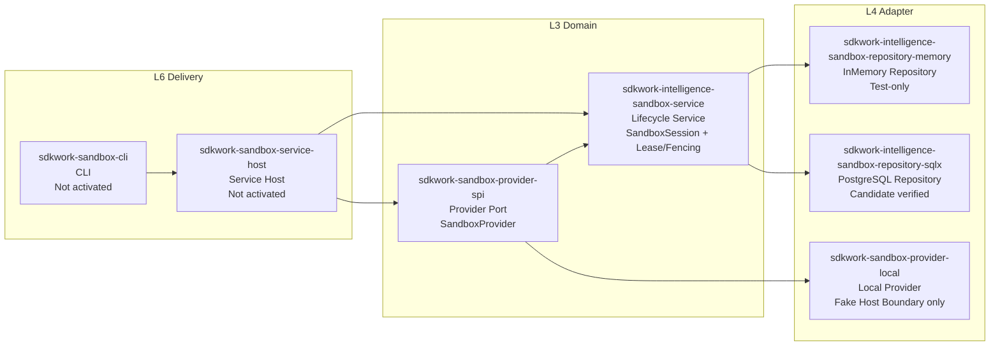

# Gate 0 Current State View

Status: active

Owner: SDKWork Runtime Platform

Updated: 2026-09-22

## 目的

本视图记录 Gate 0 阶段已物化与未物化的组件，供架构/安全评审时对照。

## 已物化 (Implemented)



## 未物化 (Deferred Until Gate 0 Exit)

```mermaid
flowchart LR
    subgraph Deferred
        CMD[SandboxCommandExecutor Port]
        FIRE[sdkwork-sandbox-provider-firecracker<br/>Firecracker Provider]
        HOST_BROKER[Host Isolation Broker]
        NET[Network Policy/Isolation]
        RES[Resource Policy/Usage]
        SCHED[Admission/Scheduler/Capacity]
        NODE[Node Trust/Attestation/Inventory]
        OBS[Observability Runtime]
        QUOTA[Quota/Capacity Persistence]
        POOL[Runtime Pool/Fast Allocation]
        TX[Workspace Runtime Transaction/Checkpoint]
        DATA[Standalone Data Residency/Recovery]
    end
```



## 组件状态矩阵

| 组件 | Crate | 状态 | 门禁证据 |
| --- | --- | --- | --- |
| Provider SPI | `sdkwork-sandbox-provider-spi` | active | `SandboxProvider` Port + Identity Types |
| Lifecycle Service | `sdkwork-intelligence-sandbox-service` | active | 26 tests, Lease/Fencing/Readiness/Idempotency |
| Memory Repository | `sdkwork-intelligence-sandbox-repository-memory` | active (test-only) | 4 tests |
| PostgreSQL Repository | `sdkwork-intelligence-sandbox-repository-sqlx` | candidate | 6 tests + live PG evidence |
| Local Provider | `sdkwork-sandbox-provider-local` | gate-0 | 5 Fake Host Boundary tests |
| Service Host | `sdkwork-sandbox-service-host` | inactive | 21-test Bootstrap/Profile/Capability Gate 0 contracts only; no wiring |
| CLI | `sdkwork-sandbox-cli` | inactive | Stub only |

## 门禁契约状态

| 契约 | 路径 | 状态 |
| --- | --- | --- |
| Provider Delivery Gates | `specs/sandbox-provider-delivery-gates.contract.json` | draft, implementationAuthorized: false |
| Local Host Boundary | `specs/sandbox-local-provider-host-boundary.contract.json` | draft, implementationAuthorized: false |
| Command Contract | `apis/commands/sandbox-command-contract.json` | draft |
| Service Host Composition | `crates/sdkwork-sandbox-service-host/specs/sandbox-service-host-composition.contract.json` | draft, implementationAuthorized: false; all referenced Profile/Capability dependencies closed |
| Firecracker Artifact | `specs/sandbox-firecracker-artifact-compatibility.contract.json` | draft |
| Network Isolation | `specs/sandbox-firecracker-network-isolation.contract.json` | draft |
| Resource Isolation | `specs/sandbox-firecracker-resource-isolation.contract.json` | draft |
| Host Isolation Broker | `specs/sandbox-host-isolation-broker.contract.json` | draft |
| Multi-tenant Scheduling | `specs/sandbox-multi-tenant-scheduling.contract.json` | draft |
| Node Trust | `specs/sandbox-node-trust-and-inventory.contract.json` | draft |
| Quota Persistence | `specs/sandbox-quota-and-capacity-persistence.contract.json` | draft |
| Runtime Pool | `specs/sandbox-runtime-pool.contract.json` | draft |
| Lifecycle History/Idempotency | `specs/sandbox-lifecycle-history-and-idempotency.contract.json` | draft, implementationAuthorized: false |
| Workspace Runtime Transaction | `specs/sandbox-workspace-runtime-transaction.contract.json` | draft, implementationAuthorized: false |
| Standalone Data Residency | `specs/sandbox-standalone-data-residency.contract.json` | draft, implementationAuthorized: false; Local-only release evidence gate |

## 需求状态

| REQ | 标题 | 状态 |
| --- | --- | --- |
| REQ-2026-0001 | Foundation | accepted |
| REQ-2026-0002 | Lifecycle Core | accepted |
| REQ-2026-0003 | Local Provider | draft |
| REQ-2026-0004 | Agents Workspace Attachment | accepted |
| REQ-2026-0005 | PostgreSQL Repository | accepted |
| REQ-2026-0006 | Key Rotation | accepted |
| REQ-2026-0007 | Command Execution | draft |
| REQ-2026-0008 | Firecracker Provider | draft |
| REQ-2026-0009 | Service Host | draft |
| REQ-2026-0010 | Observability | draft |
| REQ-2026-0011 | Host Isolation Broker | draft |
| REQ-2026-0012 | Firecracker Artifact | draft |
| REQ-2026-0013 | Workspace Block Device | draft |
| REQ-2026-0014 | Network Isolation | draft |
| REQ-2026-0015 | Resource Isolation | draft |
| REQ-2026-0016 | Multi-tenant Admission | draft |
| REQ-2026-0017 | Node Trust | draft |
| REQ-2026-0018 | Quota Persistence | draft |
| REQ-2026-0019 | Runtime Pool And Fast Allocation | draft |
| REQ-2026-0020 | Lifecycle Hot State And Idempotency Retention | draft |
| REQ-2026-0021 | Workspace Runtime Transaction And Checkpoint | draft |
| REQ-2026-0022 | Standalone Data Residency And Recovery | draft |
| REQ-2026-0023 | Internal Control Plane | draft |
| REQ-2026-0024 | Interactive Terminal Session | draft |
| REQ-2026-0025 | Runtime Secret Projection | draft |
| REQ-2026-0026 | Cloud Data Residency And Recovery | draft |
| REQ-2026-0027 | Cross-Repository Version Compatibility And Release Set | draft |

## 验证门禁

```bash
node tools/check-sandbox-cargo-path-dependencies.mjs
node tools/check-sandbox-workspace-dependency-inheritance.mjs
node tools/check-sandbox-doc-integrity.mjs
node tools/check-sandbox-component-contract-alignment.mjs
node tools/check-sandbox-requirement-traceability.mjs
node tools/check-sandbox-e2b-parity-matrix.mjs
node tools/check-sandbox-e2b-field-parity.mjs
node ../sdkwork-specs/tools/check-workspace-path-portability.mjs --root .
node ../sdkwork-specs/tools/check-shell-portability.mjs --root .
node tools/check-sandbox-platform-code.mjs
node tools/check-sandbox-database-contract-reproducibility.mjs
cargo fmt --check
cargo check --workspace
cargo test --workspace
cargo clippy --workspace --all-targets -- -D warnings
node --test tests/contract/*.test.mjs
node ../sdkwork-specs/tools/check-repository-docs-standard.mjs --root .
node ../sdkwork-specs/tools/check-workspace-packages-layout.mjs --root . --mode enforce
node ../sdkwork-specs/tools/check-component-port-bindings.mjs --root . --strict
node ../sdkwork-specs/tools/check-application-layering.mjs --root .
node ../sdkwork-specs/tools/check-identity-naming.mjs --root .
node ../sdkwork-specs/tools/audit-repository-baseline.mjs --root .
node ../sdkwork-specs/tools/check-database-framework-standard.mjs --root .
node tools/check-sandbox-evidence-traceability.mjs
node tools/check-sandbox-human-review-signoff.mjs
```

格式门禁使用 `cargo fmt --check`；禁止 `cargo fmt --all -- --check`，因为 `--all` 的语义包含本地路径依赖，会把兄弟仓库的格式偏差算到本仓门禁上。`check-sandbox-cargo-path-dependencies.mjs` 必须最先运行：清单里多余的 `..` 会让 `cargo metadata` 失败，导致其后所有 cargo 命令无法运行。`check-component-port-bindings.mjs --strict` 要求每个声明了自有源码的组件 spec 声明 `contracts.layerRole`（`APPLICATION_LAYERED_ARCHITECTURE_SPEC.md` 第 2 节对新的可组合模块是 MUST）：本仓 8 个 crate 级 spec 都正确声明，唯独 2026-08-30 加入的仓根 `specs/component.spec.json` 漏了，于是这条命令在文档里被写了四处、却一直在红；已补 `runtime-composition` 并把该命令接进 `_sdkwork:check`，否则同一个洞会再次漏进来。`check-sandbox-doc-integrity.mjs` 覆盖规范门禁不管的两件事：相对 Markdown 链接可解析、live 文档围栏代码块里的命令可执行（`docs/changelogs/`、`docs/engineering/reviews/`、`docs/releases/`、`docs/archive/` 属时点证据，豁免命令规则）。`check-sandbox-component-contract-alignment.mjs` 从 `COMPONENT_SPEC.md` 散文派生规则（不复制清单），校验声明语言必须有对应源码、有源码必须引用语言与代码风格 spec、`rust-api-assembly` 必须引用其 MUST 句点名的全部 spec 并声明 `component.surface: "api-assembly"`。`check-sandbox-database-contract-reproducibility.mjs` 用临时副本重跑注册的 `db:materialize:contract`，比对 `database/contract/` 三个生成物与提交内容是否逐字节一致；生成器不认识的字段会被静默删除，因此不可复现的注册表意味着运维每次重生成都会丢数据。`check-sandbox-requirement-traceability.mjs` 落实 `DOCUMENTATION_SPEC.md` 第 28 节的追溯链与 `REQUIREMENTS_SPEC.md` 第 6 节"被引用的需求 id 必须解析到真实记录"：live 文档里的 `REQ-*`/`ADR-*` token 必须解析到本仓记录或被同行兄弟仓路径限定；本仓需求与决策记录必须被自身以外的 live 文档引用；`PRD-capabilities.md` 第 11 节每行必须被归类（承载 `REQ-*` / 标 `无` / `同上` 继承），并打印能力普查数字。裸写跨仓 id 是该门禁存在的原因：交付计划把 `sdkwork-kernel/docs/product/requirements/REQ-2026-0002-distributed-execution-placement-control-plane.md` 与 `sdkwork-birdcoder/docs/product/requirements/REQ-2026-0006-hybrid-local-cloud-agent-execution.md` 写成裸 `REQ-2026-0002` 与 `REQ-2026-0006`，而这两个号同时也是本仓的 Lifecycle Core 与 Key Rotation 记录，于是引用表面可解析、实际指向错误记录。

`check-sandbox-e2b-parity-matrix.mjs` 是唯一读 `docs/architecture/tech/TECH-e2b-capability-parity.md` 的门禁，十条规则族：四级状态标记必须与声明词表一致、矩阵行必须 `1..N` 连续且五格齐备、每行状态格必须落在四级标记内、普查分类必须与矩阵小节按序一一对应、逐分类计数与合计行与重算总量必须三方一致、`REQ-*`/`ADR-*` token 必须可解析且该文档被 `TECH_ARCHITECTURE.md` 与 tech README 链接、在 `docs/INDEX.yaml` 登记，以及**第 3.2 节覆盖空档表必须带性质可核验**。合计行含 Markdown 强调（`| **合计** | **78** | … |`），不剥离星号就会被解析成「没有合计行」，于是全部合计断言被静默跳过、门禁把**重算**值当成**已核对**值打印出来——这是本门禁自己踩到的静默漏洞，已修并锁进契约测试。第七条补的是本节最该被证伪的那种句子：「缺什么」的清单如果只是散文，谁也无法用一次目录列举把它推翻。因此每行必须声明性质（`治理阻塞` / `缺门禁` / `缺产物`）并点名取证物，门禁按性质**反向核验**：`缺产物` 的路径必须不存在、`缺门禁` 的路径必须存在、`治理阻塞` 必须点名一份**记录在案且尚未 `ready`** 的需求；空表也算失败，因为它等价于宣称审计已完成。**本表此前真的写错过**：第 5 行曾断言"既无参考硬件也无 Benchmark 套件（`REQ-*` 为零）"，而 `tools/bench-sandbox-lifecycle.mjs`、两平台原始样本与 `REQ-2026-0019`（其 Goals 明写 p95 小于 500 ms）都在树里。逐族耦合自证也做到了：把本族判据逐条最小置空后，转红的**恰好是本族**的反面用例（7 / 7，异族 0 条，套件总数 37 不变，`Buffer.compare` 逐字节还原）；这次置空还顺手抓出一个真缺陷——分类数不匹配时越界读 `census.categories[index]` 会让门禁抛 TypeError 而不是报告，已补兜底。第八条**零需求断言**补的是最后一种不可证伪的句子：「某能力背后没有需求」——它的宾语是需求目录，所以目录可以反证它。§3.4 把这类断言逐条登记（主题 + 会被拿去比对的关键词），门禁按每份需求记录的 id / 文件名 slug / title 反查，命中即转红并点出是哪一份记录；断言只能从登记表发出，正文每处同类句子必须带 `〔§3.4/N〕` 引用，且**每一行至少被引用一次**（两向记账）。口径刻意只取 id/slug/title 不取正文——实测各记录正文提到这些词时都在说别的事（`suspended` spawn、密钥轮换的 `Pause/Resume`、`resume cursor`、`runtime recovery`），读正文会让整张表因为错误的原因变红。反证即验证：把上一轮那个假断言登记进去（关键词 `allocation`），门禁立刻因 `REQ-2026-0006-sandbox-provider-allocation-key-rotation` 与 `REQ-2026-0019-sandbox-runtime-pool-and-fast-allocation` 转红。第九条**实现面覆盖**读的是 §3.1——本仓最让人安心的一张表，也是此前唯一没人核过的表。它声称自己是"本仓全部真实实现"，实际只覆盖 3 个 crate 的 49 个用例，而工作区有 10 个文件、68 个用例：两个仓储 crate 连同 19 个用例根本没进表。门禁因此改成双向记账：每条引用的实现路径必须存在（带 `:line` 时该行必须在文件内）、引用的用例必须由所引测试文件声明、而工作区声明的每个 `#[test]` / `#[tokio::test]` 必须被认领恰好一次。写这条规则时顺手暴露了让这类缺口隐身的口径缺陷：`#[tokio::test(flavor = "multi_thread", worker_threads = 4)]` 带参数，只认 `#[tokio::test]` 的正则会**静默丢掉它**，第一版数出 67 个测试而工作区是 68 个——与"operationId 抽取漏掉点号 ⇒ 一度报出 36 个未覆盖、真值 19"是同一类缺陷。第十条**自描述计数**要求描述本门禁的四个表面声明同一个规则族数（数量由 `RULE_FAMILIES` 推导，不是手打）；加完第九条后有两个表面仍写着"八条"，门禁立刻转红。读这个数还得先分清散文与代码围栏：一节的结尾若是它自己的 usage 围栏，文件名会出现在声明计数那句话**之后**，把围栏当成"点名本门禁的块"会让定界晚一块，门禁于是对一节写得很清楚的散文报「没有声明规则族数」。当前读数：17 分类 / 78 行 / `✅ 0 | 🟡 16 | ❌ 60 | ⛔ 2` / 6 条覆盖空档 / 7 条零需求断言 / 68 / 68 工作区用例已被 §3.1 认领 / 十条规则在四个表面一致。

`check-sandbox-e2b-field-parity.mjs` 读的是矩阵所依赖的那份**基准**，而不是文档本身。矩阵门禁证明文档内部自洽，但它无法证明文档**被读过**：此前 78 行里有 23 行标着 `基准仅索引`，即只按 E2B 文档索引的页面标题判定，没有一个字段名被回到定义它的那一页核对过——一张加得起来的普查表压在页面标题上，正是对齐审计最难自查的失效形态。`specs/sandbox-e2b-capability-baseline.json` 用抓取清单替代回忆，门禁则让两者同步。十条规则：基准形状、逐来源 provenance、逐行证据、分类对齐、与文档逐行 join、`基准仅索引` 棘轮（`maxIndexOnlyRows` 不许回退）、**operation 覆盖记账**、在审计文档与 `specs/README.md` 的登记、**测试清单**、以及**自描述计数**。第七条是暴露真实缺口的那一条：71 个 OpenAPI operation 里 **70 个**被某行以 `[operationId]` 引用，仅 **1 个**（`getHealth`，控制面存活探针）登记为"本审计未枚举"并给出理由；既未引用也未登记即转红，既引用又登记为未判定也转红。这个数字经过两次更正：首轮用 `[A-Za-z0-9_]+` 抽 operationId，`filesystem.Filesystem.Stat` 与 `process.Process.Start` 含点被静默丢弃，一度报出 36；次轮报 19，其中 18 个并非缺口而是**记账错误**——它们本就是某行判定能力的证据（Templates REST 生命周期归行 26、alias 归行 29、`GET /envs` 归行 1、`GET /metrics` 归行 65）。**审计真正依据的是"抽取规则被核对过、归属被论证过"的那个数字，不是第一次打印出来的那个**。当前读数：78 行逐行取证 / 17 分类 / 101 个来源 / 0 行索引口径（上限 0）/ 71 operation：70 已判定、1 已登记未枚举。第九条**测试清单**把审计文档里声明的用例数变成可核对的数字：契约用例由 `tests/contract/*.test.mjs` 重算，Rust 读数无法静态推导，因此与命令一起落盘到 `baseline.testInventory.rustWorkspace` 再比对—覆盖章此前一直写着 `406 pass / 0 fail` 与 `63 passed / 1 ignored`，而套件早已是 533、`cargo test --workspace` 早已报 67。第十条**自描述计数**要求描述本门禁的四处措辞都声明同一个规则族数（数量由 `RULE_FAMILIES` 推导，不是手打的）：根 `README.md` 在 operation 覆盖记账存在之后仍写着“seven”，因为加规则族时没人回头改那段话。

`check-sandbox-platform-code.mjs` 是唯一读 `docs/architecture/tech/TECH-platform-support.md` 的门禁，补的是上游两条可移植性门禁留下的那个不变式：`check-workspace-path-portability.mjs` 管机器绝对路径、`check-shell-portability.mjs` 管 shell 语法，**两者都不看 `#[cfg(windows)]`、`std::process::Command`、`libc::` 或 `std::path::MAIN_SEPARATOR`**，因此某个运行后端可以变成只支持单一平台而全部门禁仍然全绿。它同时补掉了自己的接线洞：2026-09-22 之前这两条上游门禁对本仓是**通过但从未执行**（都不在 `package.json` 里），`DEPENDENCY_MANAGEMENT_SPEC.md` 第 1 节的跨平台要求长期没有执行者。门禁要求：矩阵每行必须引一条可解析的仓内路径或探测词表里的能力 id（词表是 import 进来的，不是抄一遍）、`crates/*/src` 里每个平台标记都必须在文档中声明平台与理由并与源码双向一致、文档点名的每条门禁必须在 `package.json` 里真的调用同一个脚本。门禁在真实文档上跑出过两个解析缺陷并已锁进契约测试：反引号内的 `|`（`namespace.mount|pid|uts`）会切断表格行，使证据格提前结束、其后的引证（含一条不存在的路径）完全不被检查；空声明表的占位行 `| （无） | | | |` 被当成声明读入，于是「当前声明 0」反而报出三条错误。当前读数：5 个平台（`windows-x64` unsupported、`linux-x64-wsl2` partial、`linux-x64-native`/`linux-aarch64` unmeasured、`macos-arm64` unsupported）、`crates/*/src` 平台条件标记 0 处。实测量见 `docs/architecture/tech/TECH-performance-baseline.md`。

上述 Phase 0 Repository Baseline 在 2026-07-30 通过。Service Host 现要求 18 个 Gate 依赖，其中 Workspace Runtime Transaction 是 Local/Cloud 公共关闭失败依赖，Standalone Data Residency/Recovery 只适用于 `sandbox_standalone_local` 并在 Firecracker Profiles 中禁止；聚焦测试还覆盖 Local/Cold/Pool 分离、Revision/Checkpoint 顺序、Command/Terminal 条件门禁，以及 11 类 Local 数据、数据库角色、Capability 分离、无隐式传输、Backup/Restore 和 Purge。完整验证数字以 PLAN-2026-0002 当前 Checkpoint 为准。Provider、Service Host、Cloud、Pool、Local Data Claim 与商业 Release Gate 仍因 `implementationAuthorized: false` 和待人工评审保持关闭；不得把 Baseline PASS 解释为运行时或发布就绪。
