# PLAN-2026-0002: Commercial Cloud Agent Runtime Delivery

Status: draft

Requirements: REQ-2026-0003, REQ-2026-0005, REQ-2026-0007 through REQ-2026-0022

Owner: SDKWork Runtime Platform

Updated: 2026-07-30

## Outcome

Deliver a commercially operable Sandbox product in which BirdCoder supports evidence-backed device-local and Cloud coding through one semantic path: `sdkwork-agents` authorizes Workspace/Revision and owns business state, `sdkwork-kernel` maps provider-neutral execution intent, and `sdkwork-sandbox` admits, allocates, attaches, executes, checkpoints, compensates, sanitizes and releases an isolated environment. Local uses the Standalone Local execution profile but may claim device-local persistence or strict device-local processing only after REQ-2026-0022 evidence passes; Firecracker on verified Linux KVM nodes is the Cloud multi-tenant profile.

Current release decision: **No-Go**. The repository is internally consistent at Gate 0, but it has no production Sandbox execution path. Passing contract tests currently proves that implementation remains disabled; it does not prove Local, Firecracker, SaaS or commercial readiness.

## Scope And Authority

- This plan composes the existing PRD, REQ/ADR set and [PLAN-2026-0001](PLAN-2026-0001-local-and-firecracker-provider-delivery.md). It does not supersede their security gates.
- `sdkwork-agents` owns user/tenant authorization, Workspace/Project/Session business state, Revision targets, conflict policy and Revision promotion.
- `sdkwork-kernel` owns Agent orchestration, the Provider-neutral Sandbox adapter, and its own Execution Placement record/lease/fencing/recovery. The approved target input is Opaque Identity/Revision Authorization, Capability, Minimum Assurance, Workload Class, Mount Mode and operation control; it never selects physical infrastructure.
- `sdkwork-sandbox` owns `SandboxWorkspaceRuntimeTransaction`, `SandboxSession`, its own Capacity Placement/Runtime Allocation Binding/lease/fencing, Provider selection, admission, scheduling, capacity, Pool, execution isolation, durable Checkpoint handoff, compensation, cleanup and usage facts.
- Kernel Execution Placement and Sandbox Capacity Placement/Runtime Allocation are correlated by opaque reference and generation but never share record identity, lease, fencing token, operation/idempotency scope or reconciliation authority.
- Drive or an independently approved Block-volume authority owns Workspace bytes and Checkpoint Candidate storage; Sandbox and BirdCoder do not create parallel object-storage lifecycle.
- Commerce owns SKU/price/invoice/payment. Sandbox metrics are never Billing Truth.
- Deployment, packaging and `sdkwork.app.config.json` remain out of scope until the related Requirements are `ready` and production topology receives human approval.

## Target Architecture

```mermaid
flowchart LR
    USER[User / Agent request] --> AGENTS[sdkwork-agents<br/>identity, policy, workspace authority]
    AGENTS --> KERNEL[sdkwork-kernel<br/>agent orchestration]
    KERNEL -->|opaque placement ref/generation + revision auth + capabilities + assurance + workload class| LIFECYCLE[Sandbox lifecycle service]
    LIFECYCLE --> TX[Workspace runtime transaction]
    TX --> ADMISSION[Admission + tenant quota reservation]
    ADMISSION --> SCHEDULER[Scheduler + verified node inventory]
    SCHEDULER --> CAPACITY[PostgreSQL capacity reservation]
    CAPACITY --> MODE{Explicit eligible pool request?}
    MODE -->|No: cold allocation| NODE[Attested node agent]
    MODE -->|Yes: optional claim| POOL[Runtime pool claim]
    POOL --> NODE
    NODE --> PROVIDER[Local or Firecracker provider]
    PROVIDER --> WORKSPACE[Authorized revision projection]
    WORKSPACE --> CHECKPOINT[Durable candidate + Agents revision handoff]
    PROVIDER --> BROKER[Host isolation broker]
    PROVIDER --> MICROVM[Firecracker microVM]
    LIFECYCLE --> OUTBOX[Events + audit + usage outbox]
    OUTBOX --> COMMERCE[Commerce metering consumer]
```



The Local standalone path uses the same Revision/Transaction/Command/Checkpoint outcome while recording typed no-op evidence for Cloud-only capacity stages. Workspace upload is denied by default, but an all-data device-local claim additionally requires role-correct local Agents/Sandbox PostgreSQL, declared Kernel/BirdCoder `client-local` stores, separate runtime capabilities, transfer controls, backup/restore, export/purge and real OS/network evidence. It does not claim Cloud trust, multi-tenant isolation or Pool. The Cloud path never falls back to Local, Docker or a weaker assurance level.

## Current Problems

| Severity | Problem | Evidence | Release effect |
| --- | --- | --- | --- |
| P0 | Provider implementation is explicitly unauthorized. | `specs/sandbox-provider-delivery-gates.contract.json` is `draft` with `implementationAuthorized: false`; all provider REQ/ADR reviews are pending. | Real Host/KVM work must not start. |
| P0 | Local is test-only. | `sdkwork-sandbox-provider-local` exports no port and only compiles a fake host boundary under `#[cfg(test)]`; the focused Local Host Boundary contract is static and keeps Host I/O/process spawn disabled. | No executable V1 product. |
| P0 | Shared command execution has schemas but no Rust port/executor. | Contract tests reject `SandboxCommandExecutor` materialization. | Kernel cannot run a real command through Sandbox. |
| P0 | Interactive IDE Terminal has no ready contract. | REQ-2026-0024 now supplies a draft capability/session/stream/containment contract, but Command/Interactive Terminal naming, exact bounds, transport and runtime evidence remain unauthorized. | A bounded unary Command result still cannot provide a safe commercial IDE Terminal. |
| P0 | Kernel-to-Sandbox cloud control-plane transport is unresolved. | REQ-2026-0021 excludes API/SDK/transport implementation; REQ-2026-0023 now supplies a draft in-process/internal-RPC parity contract but remains unauthorized. | Kernel cannot compose Sandbox across cloud processes or nodes until authority, compatibility and retry semantics are approved and materialized. |
| P0 | Runtime Secret projection has no ready authority. | REQ-2026-0025 now supplies a draft value-free grant/projection/rotation/revocation/cleanup contract, but no Local/Cloud Secret Authority, exact budget, process projection or real evidence is approved. | Credentialed builds remain disabled until the candidate reaches ready and is materialized without ambient-secret leakage. |
| P0 | Firecracker data plane does not exist. | No `sdkwork-sandbox-provider-firecracker` crate, Broker, VMM launcher or Guest Agent integration. | No isolated Cloud runtime. |
| P0 | Service Host and CLI are stubs. | Service Host now has fail-closed Bootstrap and Profile/Capability contracts, including safe config, preopened runtime directories, repository-only database composition and bounded Telemetry, but both crates still have no runtime composition or commands. | No runnable standalone or node process. |
| P0 | Cloud admission, scheduler, node trust and Pool are contracts only. | REQ-2026-0016/0017/0019 are draft; no ports, tables, workers or node agent. | Users cannot be assigned trusted capacity. |
| P0 | Quota/capacity persistence is blocked by SQL subject identity debt. | Existing `tenant_id TEXT` conflicts with the required positive `BIGINT` subject model in REQ-2026-0018. | No authoritative quota or no-overcommit guarantee. |
| P0 | Firecracker supply chain has no concrete release tuple. | No approved Firecracker/Jailer/Kernel/RootFS/Guest Agent versions, digests, signatures, SBOM/provenance or revocation owner. | `MicroVm` assurance cannot be claimed. |
| P0 | Workspace, network and resource isolation are not implemented. | Draft Gate 0 contracts only; no block device/KMS, netns/Tap/firewall, cgroup v2 or effective readback. | Tenant isolation and usage facts are unproven. |
| P0 | Allocation, Attachment, Command, Checkpoint and Release had no single transaction authority. | REQ-2026-0021 now defines the missing Gate 0 composition, but no Port, state store or runtime exists. | Pool/Attachment unit correctness cannot prevent end-to-end lost writes or capacity leaks. |
| P0 | Cloud Workspace execution is unresolved in BirdCoder. | BirdCoder `sdkwork-birdcoder/docs/product/requirements/REQ-2026-0006-hybrid-local-cloud-agent-execution.md` and `hybrid-execution-commercial-readiness.spec.json` now formalize per-Session intent but are `blocked`/pending human review; the current local binding is transitional, Cloud remains hard-disabled, and Remote Terminal still emits `/bin/bash -lc` command strings. | BirdCoder cannot safely execute Cloud code through the Sandbox Command contract. |
| P0 | Agents durable execution orchestration is not authorized or implemented. | Agents `agent-execution-placement-orchestration.contract.json` is `draft`/`implementationAuthorized: false`; current client-created binding is transitional, Turn does not consume resolved placement, process-local semaphore is the active concurrency gate, and lease/outbox/organization-isolation evidence is incomplete. | No authoritative SaaS execution intent, retry, cancellation or tenant-isolated handoff exists. |
| P0 | Kernel adapter is lifecycle-only and legacy execution can bypass policy. | Kernel `sdkwork-kernel/docs/product/requirements/REQ-2026-0002-distributed-execution-placement-control-plane.md` and its review are `blocked`/No-Go; `sandbox_runtime.rs` still lacks Revision/Attachment/Command/Checkpoint intent, while public legacy `SandboxProvider`/`PlatformSandboxProvider`/`NoOpSandboxProvider` can bypass the target policy path. | One security authority is not enforced. |
| P0 | Kernel Execution Placement and Sandbox Capacity Placement are not correlated as independent fenced records in runtime code. | Draft contracts now require distinct IDs, leases, fencing and idempotency, but the current Kernel adapter and Sandbox lifecycle schema have no approved cross-plane reference/generation contract. | Duplicate or delayed delivery can create dual placement authority or stale side effects. |
| P0 | Local all-data-local runtime evidence is absent. | REQ-2026-0022 now defines the 11-class, four-repository, database-role, capability, transfer, backup/restore and purge Gate, but it remains draft; no real composition or OS/network evidence exists. | Local commercial privacy and recovery claims remain No-Go. |
| P0 | Cloud data residency and recovery is not one approved release gate. | REQ-2026-0026 now supplies a draft Cloud-only inventory/region/replication/backup/PITR/recovery/export/delete contract, but no region policy, storage authority, exact RPO/RTO or real recovery evidence is approved. | Cloud isolation alone cannot prove SaaS privacy, residency, deletion or recovery claims. |
| P0 | Workspace byte and Checkpoint storage authority is unresolved. | Workspace Attachment contract leaves Block-volume authority unresolved; no durable Candidate/Handoff implementation exists. | ReadWrite Cloud sessions can neither prove durability nor safe revision conflict handling. |
| P0 | No real KVM evidence environment is assigned. | Firecracker review lists x86_64/aarch64 KVM runners and operations owner as unresolved. | Firecracker acceptance cannot run. |
| P1 | Observability/audit/outbox are static contracts only. | No exporter, outbox migration/worker, dashboards, alerts or retention evidence. | Incidents, support and metering are not operable. |
| P1 | Kernel integration is only lifecycle-candidate level. | Kernel adapter exists, but command execution, cloud transport and conformance are absent; a legacy one-shot Kernel `SandboxProvider` remains public. | Risk of duplicated lifecycle or provider branching. |
| P1 | IDE disconnect, reconnect, writer concurrency and checkpoint conflicts are not implemented. | REQ-2026-0021 has static bounds/compensation only; exact grace and retention values await owners. | High-concurrency SaaS sessions risk leaked capacity or ambiguous save outcomes. |
| P1 | Production topology and release identity are absent by design. | No Sandbox app manifest, production config, image/package, service unit or rollout/rollback automation. | Nothing can be commercially deployed. |
| P1 | Cross-repository version compatibility is not approved or materialized. | REQ-2026-0027 now supplies a draft immutable release-set and multi-dimensional compatibility contract, but no Release Authority, exact four-repository revisions, generated SDK/RPC provenance, registry, mixed-version evidence, rollout/drain or rollback implementation is approved. | Independent rolling changes can still cross incompatible lifecycle, fencing, checkpoint, Secret, residency or assurance semantics. |
| P1 | Live PostgreSQL verification is not yet archived by release CI. | The repository-owned disposable runner passes PostgreSQL 16 and 17 locally, including exact destructive-test URL latching, migration idempotency, status/drift, Repository behavior, plaintext denial and backup/restore; the default workspace suite intentionally skips the external test and no CI job archives the matrix evidence. | Current implementation evidence is reproducible, but release evidence is not yet continuously enforced or retained. |
| P1 | Lifecycle Operation history has no approved retention or compaction policy. | Session/Operation lookup reads complete ordered history and Reconciliation performs pre-Lease per-candidate hydrate. REQ-2026-0020 now defines bounded Hot State, a point-lookup ledger and migration gates, but exact limits/retention/Late Retry decisions remain pending. | Long-lived Session cost is not commercially bounded yet; schema/code changes remain unauthorized. |
| P1 | SLO and performance claims have no reference benchmark. | No fixed hardware/workload/sample report for cold, Prepared or Warm allocation. | The p95 target is not yet a release claim. |
| P1 | Operations evidence is incomplete. | Candidate runbooks exist, but node drain, artifact rollback, compromised node, pool quarantine and region/control-plane failure drills are absent. | No supportable production service. |

## Fastest Credible Delivery Sequence

### Gate A: Human Decisions And Test Infrastructure

Exit evidence:

1. Architecture, Security, Privacy, Database and Operations owners approve Command, Local, Workspace Runtime Transaction, Standalone Data Residency/Recovery and Service Host decisions for the V1 standalone slice.
2. Firecracker reviewers approve Host Broker, artifact, Workspace, network and resource decisions for Cold Firecracker; Cloud reviewers additionally approve scheduling, node trust and quota persistence. Pool approval is required only before Slice D.
3. Gate contracts, component specs and review packets are updated together; `implementationAuthorized` changes only after every listed dependency is approved.
4. Windows, macOS and Linux Local runners plus dedicated Linux KVM x86_64/aarch64 test nodes have named owners and reproducible bootstrap.
5. Integrate the delivered PostgreSQL 16/17 evidence runner into owned CI; provide KMS test authority, PKI/attestation test authority and artifact signing/provenance pipelines.
6. Product, Database and Reliability owners approve lifecycle Operation idempotency retention, archival/compaction and maximum supported Session lifetime before any implementation changes the current full-history behavior.
7. BirdCoder, Agents, Kernel, Workspace/Drive/Storage and Runtime owners approve REQ-2026-0021 ownership, Revision/Checkpoint, independent Kernel/Sandbox placement records and cross-repository adapter decisions; Product/Privacy, Database and Local Operations owners separately approve REQ-2026-0022 claim modes, data inventory, store roles, transfer, backup/restore and purge behavior.
8. BirdCoder `sdkwork-birdcoder/docs/product/requirements/REQ-2026-0006-hybrid-local-cloud-agent-execution.md`, Agents `sdkwork-agents/docs/product/requirements/REQ-2026-0730-hybrid-agent-execution-orchestration.md` and Kernel `sdkwork-kernel/docs/product/requirements/REQ-2026-0002-distributed-execution-placement-control-plane.md` plus their ADR/Review/machine contracts reach approved implementation authority with one versioned Agents-to-Kernel and Kernel-to-Sandbox handoff; transitional client-created binding and shell-string execution are excluded from Cloud readiness.
9. Owners approve REQ-2026-0024 Interactive Terminal, REQ-2026-0025 Runtime Secret Projection, REQ-2026-0026 Cloud Data Residency/Recovery and REQ-2026-0027 Cross-Repository Version Compatibility, including public names, exact bounds, authorities, lane/region behavior, immutable revisions, compatibility/support windows and real evidence. These responsibilities are not inferred from Command, Provider, Service Host or deployment profile selection.

No implementation phase below starts before its own Gate A subset passes.

### Slice B: Local Commercial Developer Runtime

Implementation order:

1. After REQ-2026-0020 approval, migrate complete-history hydration to bounded Hot State plus a durable point-lookup idempotency ledger using the approved limits, retention, Late Retry and expand/backfill/cutover plan.
2. Materialize the approved Workspace Runtime Transaction service boundary and REQ-2026-0022 Local evidence composition. Prove BirdCoder has no business tables; Agents/Sandbox authorities resolve only to role-correct local PostgreSQL; Kernel/BirdCoder SQLite is declared `client-local`; Workspace, Service Data, Runtime Root, Cache, Log, Secret and Temp are separate; no implicit storage/sync/telemetry occurs; Backup/Restore, Export/Purge, Reset/Uninstall and failure behavior pass without Cloud fallback.
3. Materialize provider-neutral Command types and `SandboxCommandExecutor` behind the Service boundary, including logical executable identifiers, Provider-owned binding-scoped resolution without PATH/CWD lookup, immutable environment policy, fingerprint, fencing, first-terminal CAS, cancellation, timeout, output bounds and cleanup result.
4. Replace the Local fake-only boundary with a public L4 adapter that consumes an authorized Workspace Attachment port. Preserve `HostUser` assurance and default-deny Network/Browser/Port.
5. Implement the approved Local Host Boundary exactly: request identity must match opened capabilities and Runtime Binding; the binding owns one immutable execution policy and executable registry; callers cannot supply paths, trigger PATH/CWD lookup, extend environment policy, or override protected Provider values. Windows uses suspended spawn + Kill-on-close Job Object + Completion Port before Resume; Linux requires race-free pre-user-code membership in a per-binding delegated cgroup v2 Scope; macOS Terminal remains denied until detached descendants are contained. Process Group-only and spawn-then-attach are insufficient. No shell parsing or ambient environment inheritance.
6. Materialize REQ-2026-0025 Local projection only through the approved device-local Secret Authority and opened capability. Prove no Local value or grant enters Cloud, Workspace, Checkpoint, logs, support bundles or reusable Runtime state; unsupported platform/mode combinations remain denied.
7. Compose lifecycle repository, Transaction, Local Provider, Command, approved Secret projection, Checkpoint/Handoff, reconciliation, observability and bounded shutdown in `sdkwork-sandbox-service-host`.
8. Add operator CLI health/create/start/execute/cancel/checkpoint/stop/destroy flows with confirmation for destructive operations and no Secret-bearing output.
9. Run shared lifecycle/transaction/command/disconnect/checkpoint/Secret conformance plus REQ-2026-0022 database-locality, network-capture, restart, backup/restore, purge, uninstall-preservation, disk-full, corruption and residue scenarios on real Windows, macOS and Linux runners.

Launch boundary: standalone/private developer product only. It must state `HostUser`, no multi-tenant isolation, no Cloud Pool and no unverified network capability. It may publish only the exact Local data claim whose REQ-2026-0022 evidence passed; otherwise it must publish no all-data-local or recovery claim.

### Slice C: Cold Firecracker Cloud Runtime

Implementation order:

1. Complete SQL subject migration, tenant quota/admission reservation and node capacity/capacity reservation persistence with real PostgreSQL concurrency, query-plan, role and recovery evidence.
2. Implement short-lived key-bound Node Identity, mutual authentication, independent attestation verification, Verified Inventory, drain/quarantine/revocation and node agent upgrade/rollback.
3. Publish one exact signed Firecracker artifact tuple per architecture, with SBOM, provenance, vulnerability/advisory owner and rollback tuple.
4. Implement the typed local-only Host Isolation Broker with peer identity, short-lived grants, durable fencing journal and fixed privileged operations. It must never accept shell, executable, arbitrary path or remote TCP input.
5. Implement per-binding Workspace block device, at-rest encryption, network namespace/Tap/default-deny firewall and Firecracker Machine Config plus cgroup v2 CPU/memory/PID/IO.
6. Implement the Firecracker Provider, authenticated Guest Agent and REQ-2026-0021 transaction path. Start readiness requires Broker, artifact, VMM, guest, Workspace, network, resources, command policy, checkpoint capability and fencing evidence.
7. Materialize REQ-2026-0025 Cloud projection through the approved region-bound Secret Authority, workload identity and attested Guest Agent. Prove bounded rotation/revocation/outage, no value or raw-grant persistence, teardown before Checkpoint, microVM destruction and cross-Tenant/lane/region denial.
8. Implement durable Workspace Candidate/Handoff through Drive or the approved Volume Authority; prove Agents CAS promotion and non-destructive conflict behavior.
9. Run real KVM lifecycle/transaction/command/Secret/checkpoint/failure/cleanup/cross-tenant residue conformance. Cold allocation remains the correctness fallback when no clean Pool Slot exists.

Launch boundary: limited Cloud preview only after multi-tenant security review and incident drills. Do not advertise pool latency yet.

### Slice D: Runtime Pool And Fast Allocation

1. Materialize REQ-2026-0019 only after its ADR and dependency gates are approved; do not add it to the Cold Firecracker required dependency set.
2. Start with `PreparedSlot`: verified node, immutable artifacts and safe Host preparation, but no tenant state or running tenant VMM.
3. Claim only after confirmed Capacity Reservation; bind fresh Guest Identity, Workspace, Network and Resource grants; effective readback remains mandatory.
4. Implement bounded pool target/min/max reconciliation per Resource Profile and failure domain, with rate limits and no overcommit.
5. Release only through REQ-2026-0021 Freeze/Drain, durable Checkpoint/Handoff, revoke, stop, detach, erase, residue scan and quarantine. Capacity uncertainty stays consumed.
6. Add `WarmMicroVmSlot` only after clean Snapshot compatibility, identity rotation, device rebinding and cross-tenant residue evidence pass on both KVM architectures.
7. Benchmark Cold, Prepared and Warm separately. The PRD p95 below 500 ms target becomes a release gate only for the exact published profile that meets it.

### Slice E: Kernel And Product Integration

1. Keep `sdkwork-agents -> sdkwork-kernel -> sdkwork-sandbox`; Sandbox never imports Kernel or Agents.
2. Extend the Kernel adapter through approved Sandbox public ports. Kernel submits its opaque Execution Placement Ref/Generation plus Revision Authorization, `RuntimeCapability`, `IsolationAssurance`, Workload Class, Mount Mode, Deadline and cancellation; Sandbox verifies the upstream generation and chooses Provider/Node/Pool/Storage mechanism.
3. Persist Kernel Execution Placement and Sandbox Capacity Placement/Runtime Allocation as distinct correlated records with independent leases, fencing tokens, operation/idempotency scopes and reconcilers; prove duplicate, delayed, reordered, expired and cancelled delivery fails closed.
4. Retire or confine the legacy Kernel one-shot `SandboxProvider` so it cannot serve production lifecycle or bypass Sandbox policy.
5. For embedded standalone mode, compose executable public Rust ports. For split Cloud mode, author the internal API first, generate the approved SDK family, and consume it without raw HTTP or manual auth headers.
6. Make BirdCoder resolve Local/Cloud execution exclusively through generated Agents App SDK methods; remove direct shell-string execution and keep the Work Provider installer on a separately reviewed supply-chain boundary.
7. Prove end-to-end cancellation, disconnect/reconnect, checkpoint promotion/conflict, trace/event ordering, retry classification and Ready-only opaque `runtimeLocationId` mapping.
8. Bind Kernel agent/provider capability manifests to Sandbox Resource Profiles without exposing concrete Firecracker, Node, Pool or Storage identity to Agent behavior.
9. Require REQ-2026-0027 release-set identity and peer preflight before placement, Workspace mount, Secret projection, Command/Terminal attach or recovery; version-skew conformance must cover upgrade, stop-new-placement, drain, rollback, downgrade denial and end-of-support outcomes.

This slice is cross-repository work and requires human review before source changes outside `sdkwork-sandbox`.

### Slice F: Commercial Release

1. Create `sdkwork.app.config.json`, runtime profiles and deployment assets only when packaging/deployment Requirements are ready; validate against `APP_MANIFEST_SPEC.md`.
2. Ship separate control-plane and KVM node artifacts, signed with SBOM/provenance and rollback metadata.
3. Publish one approved immutable REQ-2026-0027 release set with exact source, Workspace/storage, RPC/Proto, generated SDK, config, provider/artifact and evidence revisions; mutable tags and local patches are not release identity.
4. Provide staging soak, canary, kill switch, stop-new-placement, transaction drain, schema rollback/forward recovery, artifact rollback, downgrade denial, end-of-support and compromised-node quarantine procedures.
5. Publish capability/assurance matrix, exact Local persistence/processing claim and evidence scope, Cloud data residency, supported host/KVM matrix, Workspace/Checkpoint retention and conflict behavior, limits, regional availability and explicit non-goals.
6. Connect durable usage facts to Commerce through an approved adapter. Reconcile usage, lifecycle and capacity facts before chargeability.
7. Complete tenant isolation penetration tests, dependency/CVE review, capacity test, backup/PITR restore, chaos drills and on-call handoff.

## Candidate Launch SLOs

These are planning targets, not current claims, and require Product/Operations approval plus reference-environment evidence.

| Signal | Candidate target | Evidence |
| --- | --- | --- |
| Prepared Pool claim to Running Ready | p95 < 500 ms for one published Resource Profile | fixed KVM hardware/artifact/workload benchmark |
| Cold Firecracker start | publish measured p50/p95/p99; no unmeasured promise | real KVM benchmark |
| Allocation correctness | zero double claim, double placement or assurance downgrade | contention/fencing/chaos suite |
| Tenant cleanup | zero known cross-tenant residue; uncertainty quarantines | destructive residue and restart suite |
| Control-plane availability | freeze target before release after load/failure modeling | multi-replica soak and dependency SLOs |
| Recovery | freeze RPO/RTO after PITR, node loss and control-plane restart drills | signed drill evidence |

## Commercial Release Gate

Release is allowed only when all rows have evidence:

| Gate | Required evidence |
| --- | --- |
| Product | Supported SKU/resource profiles, limits, regions, assurance wording and non-goals approved. |
| Functional | Agents -> Kernel -> Sandbox lifecycle and command conformance passes without Provider branching. |
| Security | Threat model, KVM/Jailer/Broker/Workspace/Network/Resource isolation, secret handling and tenant residue review approved. |
| Data | PostgreSQL migrations, constraints, concurrency, RLS/roles, backups, PITR, bounded lifecycle hydrate/idempotency, approved Session limits and retention verified. |
| Local privacy/recovery | REQ-2026-0022 four-repository inventory, local store resolution, no implicit transfer, role-correct restore, export/purge, uninstall preservation and real Windows/macOS/Linux network/residue evidence accepted for the published claim. |
| Secrets | REQ-2026-0025 authority, grant binding, Local/Cloud residency, target, rotation/revocation/outage, Checkpoint/Pool exclusion, audit, incident drill and real platform evidence approved. |
| Cloud data | REQ-2026-0026 data inventory, region tuple, replication, backup/PITR, restore ordering, RPO/RTO, tenant isolation, export/delete, Secret exclusion and real multi-region recovery evidence approved. |
| Compatibility | REQ-2026-0027 immutable release set, generated provenance, closed compatibility matrix, peer preflight, version-skew tests, stop-new-placement/drain, migration-aware rollback, downgrade denial and support-window evidence approved. |
| Supply chain | Signed exact artifact tuples, SBOM/provenance, CVE policy, revocation and rollback verified. |
| Reliability | Reconciliation, fencing, node drain, crash, pool quarantine, dependency outage and rollback drills pass. |
| Performance | Cold/Prepared/Warm benchmark and capacity saturation report accepted. |
| Observability | Dashboards, alerts, trace, audit, outbox, metering reconciliation and low-cardinality metrics active. |
| Operations | On-call, incident severity/ownership, runbooks, support diagnostics and customer communication path ready. |
| Release | Manifest/config/deployment validation, staging soak, canary and rollback evidence accepted. |
| Human review | Public naming, security posture, API/SDK authority, cross-repository Kernel integration and production deployment approved. |

## Verification Matrix

Run the repository baseline on every slice, then add slice-specific evidence:

```text
node tools/check-sandbox-cargo-path-dependencies.mjs
node tools/check-sandbox-workspace-dependency-inheritance.mjs
node tools/check-sandbox-doc-integrity.mjs
node tools/check-sandbox-component-contract-alignment.mjs
node tools/check-sandbox-database-contract-reproducibility.mjs
cargo fmt --check
cargo check --workspace
cargo test --workspace
cargo clippy --workspace --all-targets -- -D warnings
node --test tests/contract/*.test.mjs
node ../sdkwork-specs/tools/check-repository-docs-standard.mjs --root .
node ../sdkwork-specs/tools/check-workspace-packages-layout.mjs --root . --mode enforce
node ../sdkwork-specs/tools/check-component-port-bindings.mjs --root . --strict
node ../sdkwork-specs/tools/check-application-layering.mjs --root .
node ../sdkwork-specs/tools/check-rust-backend-composition.mjs --root .
node ../sdkwork-specs/tools/check-identity-naming.mjs --root .
node ../sdkwork-specs/tools/audit-repository-baseline.mjs --root .
node ../sdkwork-specs/tools/check-database-framework-standard.mjs --root .
node ../sdkwork-specs/tools/verify-database-initialization-state.mjs --root .
node tools/check-sandbox-evidence-traceability.mjs
node tools/check-sandbox-human-review-signoff.mjs
```

The formatting gate is `cargo fmt --check`, not `cargo fmt --all -- --check`: `--all` also formats local path dependencies, so it reports and writes formatting diffs owned by sibling repositories that this repository must not edit. `check-sandbox-cargo-path-dependencies.mjs` runs first because one surplus `..` in a manifest path dependency breaks `cargo metadata` for the whole workspace and makes every subsequent cargo command unrunnable. `check-sandbox-doc-integrity.mjs` runs because the documentation-standard validator checks document structure and path ownership only, not whether a relative link resolves or a prescribed command exists. `check-sandbox-component-contract-alignment.mjs` runs because `component.spec.json` identity and spec references are consumed by the Kernel, packaging and publication flows, while `check-rust-manifest-standard.mjs`, `validate-api-assembly.mjs` and `verify-repo.mjs` all accept a phantom `component.languages` entry, a missing `WEB_BACKEND_SPEC.md`, a missing `CODE_STYLE_SPEC.md` and a wrong `component.surface`. `check-sandbox-database-contract-reproducibility.mjs` runs because `DATABASE_FRAMEWORK_SPEC.md` section 6.2 makes `database/contract/` a generated artifact and regeneration deletes fields the generator does not know about, so a non-reproducible registry silently loses authored data; the database framework and initialization-state validators check the contract's shape against the baseline but never re-run the generator.

Additional release evidence must include live PostgreSQL, real cross-platform Local runners, real KVM x86_64/aarch64, multi-controller contention, tenant residue, security fault injection, performance, soak, PITR and rollback. Fake Host, Windows/WSL without KVM, static JSON tests and ignored integration tests do not satisfy those gates.

## Current Verification Checkpoint (2026-09-22)

Measured on the current worktree. Every command below was executed; the counts are the observed output, not carried forward from an earlier checkpoint.

| Command | Result |
| --- | --- |
| `node tools/check-sandbox-cargo-path-dependencies.mjs` | PASS: every manifest path dependency resolves and lands inside the workspace root. |
| `node tools/check-sandbox-workspace-dependency-inheritance.mjs` | PASS: 8 member manifests, 27 inherited dependency entries, 14 root `[workspace.dependencies]` keys, no member-local third-party version. |
| `node tools/check-sandbox-doc-integrity.mjs` | PASS: 195 documents, 602 relative links, 160 live documents, 145 fenced code blocks, 260 script targets, 0 unresolved links, 0 unrunnable prescriptions. |
| `node tools/check-sandbox-component-contract-alignment.mjs` | PASS: 9 component contracts; every declared language is backed by authored source, every component with source references its language and code-style specs, and `sdkwork-api-sandbox-assembly` references all seven specs its MUST sentence names and declares `component.surface: "api-assembly"`. |
| `node tools/check-sandbox-database-contract-reproducibility.mjs` | PASS: re-running the registered `db:materialize:contract` reproduces `schema.yaml`, `prefix-registry.json` and `table-registry.json` byte for byte. |
| `cargo fmt --check` | PASS over all 8 Sandbox members. |
| `cargo check --workspace` | PASS. |
| `cargo test --workspace` | PASS: 63 passed, 1 ignored (the live PostgreSQL test, which needs an external database). |
| `cargo clippy --workspace --all-targets -- -D warnings` | PASS. |
| `cargo metadata --locked` | PASS: `Cargo.lock` is synchronized with the manifests. |
| `node --test tests/contract/*.test.mjs` | PASS: 359/359. |
| Repository docs-standard, identity-naming, packages-layout, strict component ports, application layering, database framework, initialization state, Rust manifest standard, workspace path portability, Rust backend composition, crate naming standard and baseline audit validators | PASS. |
| `node tools/check-sandbox-commercial-readiness.mjs` | FAIL by design: reports NO-GO. Provider, Service Host, Cloud, Pool, Local data claim and commercial release gates stay closed until their human reviews complete. |
| `node tools/check-sandbox-evidence-traceability.mjs` | PASS as a gate: 127 required evidence ids across 8 Gate 0 contracts; 125 have no producer at all, which is the recorded Gate 0 gap, not a regression. |
| `node tools/check-sandbox-human-review-signoff.mjs` | PASS as a gate: the sign-off backlog index is complete and every review status is coherent; 14 contract-gated packets remain `pending-human-review`, and all 27 ADRs remain `proposed`. |

This checkpoint proves Sandbox code, contract, dependency and sdkwork-specs Gate 0 consistency. It is not Local Host execution, PostgreSQL release, KVM, tenant isolation, Pool latency or commercial readiness evidence.

## Historical Verification Checkpoint (2026-07-30)

Superseded by the 2026-09-22 checkpoint above; retained as a dated record of what was true on that date, including the test and crate counts that have since grown. The `cargo fmt --all -- --check` row records the prescription in force then; it was corrected to `cargo fmt --check` on 2026-09-22 because `--all` also formats local path dependencies owned by sibling repositories (see the verification block above).

| Command | Result |
| --- | --- |
| `cargo fmt --all -- --check` | PASS on the final 2026-07-30 verification baseline; the earlier external path-dependency formatting blocker is closed. |
| `cargo fmt --package <each Sandbox workspace member> -- --check` | PASS for all 7 `sdkwork-sandbox` crates. |
| `cargo check --workspace --locked` | PASS; lockfile synchronized with the current sibling database dependency graph (`url`) and Local Provider test-only command-contract parser (`serde_json`). |
| `cargo test --workspace --locked` | PASS: 44 passed, including the destructive-test URL guard; 1 live PostgreSQL test intentionally ignored in the default suite because it requires an external database. |
| `node tools/testing/sandbox-postgres-evidence.mjs --postgres-major 16` and `--postgres-major 17` | PASS for both supported majors: first/repeated migration `1/0`, clean status, no drift, 1 live Repository test passed, and all disposable containers were removed. |
| PostgreSQL 16/17 custom-format backup and empty-database restore | PASS on both majors: restored Session/Operation/Binding/Lease counts matched `11/20/9/11`; plaintext Allocation Reference matches remained `0`. |
| `cargo clippy --workspace --all-targets --locked -- -D warnings` | PASS |
| `node --test tests/contract/*.test.mjs` | PASS: 190/190, including 6 PostgreSQL evidence-runner safety contracts, 9 Command Policy, 13 Local Host Boundary, 21 Service Host Bootstrap/Profile/Capability gates, 11 Runtime Pool, 10 Lifecycle History/Idempotency Gate 0, 12 Workspace Runtime Transaction/Checkpoint gates, 12 Standalone Data Residency/Recovery gates, and 3 documentation status/index/prose alignment tests. |
| Repository docs/debt, Database Framework, packages layout, strict component ports, application layering, Rust backend composition, identity naming and baseline audit validators | PASS |
| `node ../sdkwork-specs/tools/check-unified-postgres-profile.mjs --root .` | PASS; canonical `SDKWORK_DATABASE_TEST_POSTGRES_URL` usage is accepted by the current global validator. |
| `node ../sdkwork-specs/tools/check-pnpm-script-standard.mjs --root . --application-code-prefix sandbox` | NOT APPLICABLE at Phase 0: it requires the full application lifecycle script set, while this repository has no `sdkwork.app.config.json`, executable Service Host, packaging or deployment authority. Adding placeholder `dev`, `build`, `check`, `verify` or `clean` scripts would misrepresent unavailable product capabilities. Apply this gate when the Service Host/application lifecycle requirement is ready and the application manifest enters scope. |
| `git diff --check` | PASS; only Git line-ending normalization warnings were reported. |

This checkpoint proves Sandbox code, contract and sdkwork-specs Gate 0 consistency. It is not Local Host execution, PostgreSQL release, KVM, tenant isolation, Pool latency or commercial readiness evidence.

## Immediate Human Actions

1. Assign named Architecture, Security, Platform/KVM Operations, Database, PKI/Attestation, Workspace/Data, Network, Commerce and Supply-chain reviewers.
2. Decide and record the supported launch OS/architecture matrix and first Resource Profiles.
3. Approve CI ownership and retention for the delivered PostgreSQL 16/17 runner; provide real Local CI runners, KVM nodes, KMS/PKI test environments and artifact signing authority.
4. Approve or reject the Local Host Boundary platform slice: Windows suspended Job Object, Linux race-free delegated cgroup v2, macOS Terminal denial, opened-capability Filesystem and exact dependency gate. Review the remaining Gate 0 packets, including Host Isolation Broker.
5. Decide whether the first commercial Cloud offer stops at Cold Firecracker or requires Prepared Pool before customer preview; Warm microVM remains a later evidence gate.
6. Approve REQ-2026-0020 limits, terminal retention, post-retention Late Retry, Repository/public naming and migration strategy before lifecycle persistence changes.
7. Approve REQ-2026-0021 decisions and assign BirdCoder/Agents/Kernel/Workspace/Drive owners before any cross-repository Runtime/Checkpoint implementation.
8. Approve REQ-2026-0022 claim wording, all data owners, PostgreSQL/`client-local` roles, transfer, backup/restore, export/purge and failure semantics; assign real Windows/macOS/Linux and network-evidence owners before any Local data or recovery claim.
9. Approve REQ-2026-0023 through REQ-2026-0027, assign Control Plane, Terminal, Secret, Region/Storage and Release Authorities, and provide multi-process, PTY, KMS/Secret, multi-region recovery and mixed-version release-set evidence environments before those mechanisms enter implementation.

Until these actions are complete, the only truthful deliverable is Gate 0 contract/documentation quality. The repository must not be presented as production, SaaS, Firecracker, pooled-runtime or commercial-ready.
