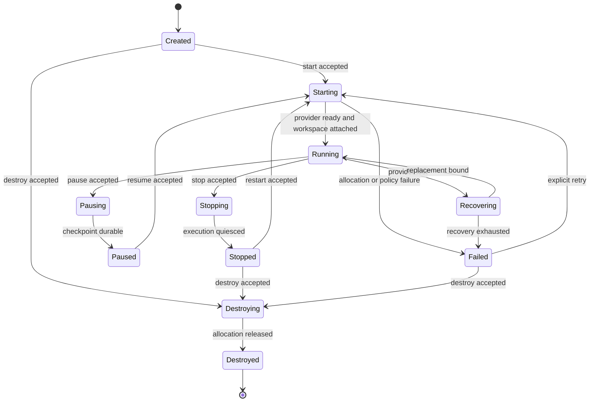

# SDKWork Sandbox 能力与生命周期需求

Status: draft

Owner: SDKWork Runtime Platform

Updated: 2026-09-23

Parent: [SDKWork Sandbox PRD](PRD.md)

Specs: `REQUIREMENTS_SPEC.md`, `SECURITY_SPEC.md`, `PRIVACY_SPEC.md`, `DATABASE_SPEC.md`, `DATABASE_FRAMEWORK_SPEC.md`, `RUNTIME_DIRECTORY_SPEC.md`, `EVENT_SPEC.md`, `OBSERVABILITY_SPEC.md`, `CACHE_SPEC.md`, `PAGINATION_SPEC.md`

## 1. 职责边界

| 关注点 | SDKWork Sandbox | Kernel 或依赖方 |
| --- | --- | --- |
| Agent Provider、Model、Prompt、推理、对话 | 不拥有 | `sdkwork-kernel` 拥有 |
| Runtime Capability 契约与执行位置 | 拥有 | Kernel 消费经过评审的 Port |
| Agent Workspace Identity 与持久生命周期 | 不拥有；只消费经授权的 Opaque Context | `sdkwork-agents` 的 `AgentWorkspace` 拥有 |
| Sandbox Workspace Attachment 与运行访问 | 拥有 Attachment Mechanism、Lease/Fencing 与 Provider-private `SandboxProviderAllocationRef` | Kernel 映射已授权的 Agents Workspace Identity；存储 Adapter 拥有物理机制 |
| Workspace Revision 与 Checkpoint | 组合 Writer Fencing、Durable Candidate/Handoff、Detach/Sanitization；不晋级业务 Revision | Agents 拥有 Revision Authorization、Conflict、Promotion 与 Retention；Drive/批准的 Volume Authority 拥有字节生命周期 |
| Standalone Local 数据驻留与恢复 | 只组合 Local Readiness Evidence，不复制任何数据权威 | BirdCoder 只拥有有界设备事实；Agents、Kernel、Workspace/Drive、Sandbox、Database、Secret 与 Backup Owner 分别拥有其数据生命周期 |
| Agent Session 业务生命周期 | 不拥有 | `sdkwork-agents` 的 `AgentSession` 拥有 |
| Sandbox Session 运行生命周期 | `SandboxSession` 与 `SandboxRuntimeBinding` 拥有 | Kernel 通过 `SandboxSessionLifecyclePort` 消费 |
| Tool 执行环境 | 拥有 Filesystem/Process/Browser/Terminal 的能力执行 | Kernel 拥有工具选择与编排 |
| Identity 与 Permission | 消费已验证上下文 | IAM 拥有认证与权限目录 |
| Quota 与 Metering | 执行已下发配额并输出用量事实 | 策略方制定限额；Commerce 负责价格/账单 |
| API/SDK 生成 | 激活后拥有 Sandbox internal-api 权威和 SDK Family | `sdkwork-specs` 定义 Wire 与生成规则 |

## 2. 核心身份

| 领域类型 | Rust 字段/变量 | 预留 Wire 字段 | 含义 | 持久性 |
| --- | --- | --- | --- | --- |
| `AgentWorkspace` | `agent_workspace_id`（Agents 边界） | `agentWorkspaceId` | Agents-owned 持久源码/数据工作集与业务 Identity | 由 `sdkwork-agents` 治理到显式删除 |
| `AgentSession` | `agent_session_id`（Agents 边界） | `agentSessionId` | Agents-owned 业务 Session 聚合 | 元数据和历史由 Agents 保留策略治理 |
| `SandboxWorkspaceId` | `sandbox_workspace_id` | `sandboxWorkspaceId` | Kernel 从已授权 Agent Workspace ID 映射的 Opaque Sandbox Context | Sandbox 不生成、不解析业务语义 |
| `SandboxSessionId` | `sandbox_session_id` | `sandboxSessionId` | Kernel 从 Agent Session ID 映射的 Opaque Sandbox 运行身份 | Sandbox 运行记录按运行保留策略持久化 |
| `SandboxId` | `sandbox_id` | `sandboxId` | 一个具体 Sandbox Provider 分配实例 | Sandbox 生成；可销毁，恢复时允许替换 |
| `SandboxRuntimeBindingId` | `sandbox_runtime_binding_id` | `sandboxRuntimeBindingId` | `SandboxSession`、Workspace Attachment、Sandbox Provider Allocation 与策略快照的版本化绑定 | Sandbox 生成；Kernel 可映射为 Opaque `runtimeLocationId` |
| `SandboxProviderId` | `sandbox_provider_id` | `sandboxProviderId` | 被选择的 Sandbox Provider Identity | Provider 注册期间校验；随 Binding 与 Operation Evidence 持久化 |
| `OperationId` | `sandbox_operation_id` | `sandboxOperationId` | Create/Start/Stop/Snapshot/Restore/Recover 等 Sandbox 长操作 | Sandbox 生成或由调用边界提供，保留到操作记录到期 |
| `SandboxLeaseOwnerId` | `sandbox_lease_owner_id` | 暂不承诺 Public Wire | 当前 Sandbox 生命周期控制器 Identity | 仅用于内部 Lease；不得替代 `SandboxSessionId` 或 Provider Identity |
| `SandboxFencingToken` | `sandbox_fencing_token` | 暂不承诺 Public Wire | 同一 Tenant/Session Lease 每次新所有权获取时单调递增的非零 Token | Repository 持久化；Provider 对旧 Token 关闭失败 |

`OperationId`、`TenantId`、`RuntimeCapability` 与 `IsolationAssurance` 是 SDKWork 共享类型，保持标准名称；它们出现在 Sandbox Command、Projection、Log 或 Event 中时，对应歧义字段和变量仍使用 `sandbox_` 前缀表达领域归属。`tenant_id` 保持平台共享 Tenant Context 名称；Sandbox 自有且跨域易混淆的身份、聚合、绑定和 Provider 对象使用 `Sandbox*` 类型名。Provider 私有 `SandboxProviderAllocationRef` 只允许由 Provider Boundary 与受控 Repository Adapter 通过变量 `sandbox_allocation_reference` 处理，禁止进入普通 Public Accessor、Debug、Wire、Log 或 Event。

对外身份必须不透明且不携带 Secret。VM、Container、Namespace、Host Path、Node ID 等 Provider 私有身份只能保留在适配器元数据中。

每次 Allocate/Start/Stop/Destroy 在 Provider 调用前续租 `SandboxSessionLease`，并携带同一当前 `sandbox_fencing_token`。控制权已由另一生命周期控制器持有时返回 `SandboxLifecycleError::LeaseUnavailable`；已取得控制权后续租、令牌校验或释放失败时返回 `SandboxLifecycleError::LeaseLost`，且不得继续 Provider Side Effect 或提交状态。Provider Operation Timeout 必须非零且不超过 Sandbox Lease Duration 的一半；Timeout 映射为 `SandboxProviderErrorKind::Timeout`，不得无限等待直到 Lease 失效。

持久化的 `SandboxSessionOperation` 使用 Tenant+Session 内从 `0` 开始的稳定 `sandbox_operation_sequence`，不能以时间戳或随机 ID 推导生命周期顺序。Repository Restore 必须先重放 Create/Start/Stop/Destroy Operation 并验证 Session State、Typed Failure、Runtime Binding 与 Allocation 组合，再解密 Provider-private Metadata；非法组合关闭失败，不进入 Provider 调用。

## 3. Sandbox Session 状态机

- 状态变化必须由 Command 驱动、校验、可观测，并在适用时具备幂等性。
- 目标态标记：`Pausing`、`Paused`、`Recovering`。
- 这三个状态是本图的规范目标态：实现枚举 `SandboxSessionState`（当前 8 态，见 `crates/sdkwork-intelligence-sandbox-service/src/model.rs`）尚未包含它们；任一目标态进入实现前必须先扩展该枚举并同步本图，本标记随实现落地收缩，由 `node tools/check-sandbox-requirement-traceability.mjs` 双向核验。
- 只有 Provider Ready、Policy 生效、Workspace 挂载全部成功后才能进入 `Running`。
- `Destroyed` 禁止后续执行，但不表示删除 Workspace。
- Provider 丢失后进入 `Recovering` 或 `Failed`，不能为同一 Binding 产生两个活动所有者。
- Workspace 删除属于 Agents-owned `AgentWorkspace` 业务操作，必须经过授权、保留策略、Snapshot 与审计检查；Sandbox 不提供该命令。

## 4. Workspace 生命周期与 Sandbox Attachment

Workspace 术语保持不变，但业务权威位于 `sdkwork-agents`。`AgentWorkspace` 能力包括 Create、Clone、Checkout、Branch、Pull、Commit、Push、Snapshot、Restore 与 Delete；Sandbox 只实现 Attach/Detach 和受控运行访问。Git 能力按需开放，Git Credential 不得默认写入 Workspace 文件。

验收边界：

- 路径解析必须阻止目录遍历、Symbolic Link/Reparse Point 越界、Mount Escape、Alternate Data Stream 等适用攻击。
- 默认禁止多个活动 Session 共享写挂载；任何共享写模式必须拥有明确一致性契约。
- Workspace Size、File Count、Log Output 与 Temp Data 必须受 Quota 限制。
- 删除 Sandbox 或 `SandboxSession` 不得隐式删除 `AgentWorkspace`。
- Restore 必须生成可审计 Revision，不得静默覆盖活动绑定。

运行环境与 Workspace 数据必须分离。`standalone/local` 使用 Composition 已打开且绑定到 Runtime Binding 的 Device-local Workspace Capability，Runtime Root 与 Workspace Capability 不得相同；`standalone/firecracker`/`cloud/firecracker` 使用独立加密 Guest Block Device，RootFS、Workspace、Cache、Temp 与 Log 不得合并。Sandbox 不从 Workspace ID 推导 Path，也不把 Host/Device/Object Metadata 暴露给 Kernel 或 BirdCoder。

ReadWrite Runtime 使用 REQ-2026-0021 的单 Writer Revision Target。Command Admission Freeze 并 Drain/Cancel 活动命令后，Attachment Adapter 才能 Flush 并产生耐久 `SandboxWorkspaceCheckpointCandidate`；Handoff 持久化后 Runtime 才能 Detach/Sanitize/Release。Agents 以 Source Revision 执行 CAS Promotion；Revision Conflict 不得覆盖更新版本，也不得伪装为保存成功。

REQ-2026-0022 将 Local 数据承诺从 Workspace 扩展到 BirdCoder 设备事实、Agents 业务数据、Kernel 瞬态状态、Sandbox 控制状态、Runtime Root、Cache、Log/Audit、Secret、Temp/Output、Checkpoint Candidate 和 Backup。`standalone`/`local` 只是拓扑与 Provider 事实；只有 `sandbox_standalone_local` 完成全部证据后才能使用候选 `device-local-persistence` 声明，`strict-device-local-processing` 还必须拒绝源码、Prompt、Transcript、Artifact、Secret 和诊断内容外传。Agents/Sandbox 服务权威保持本机 PostgreSQL，嵌入式 SQLite 只允许用于声明为 `client-local` 的 BirdCoder/Kernel 有界状态，且不得作为 Server Fallback。

Workspace、Service Data、Runtime Root、Cache、Log、Secret 与 Temp 必须是不同的预打开 Capability。Runtime Cleanup、默认 Reset 和 Uninstall 保留用户拥有的 Workspace；Remote Backup/Sync/Telemetry 默认拒绝，Backup 必须本地、按数据库角色执行、包含完整性清单并通过 Restore Test。Corruption、Disk Full、Local Database 或 Capability 不可用、Restore/Purge 不确定均关闭失败，不得自动回退 Cloud 或静默丢弃权威数据。

## 5. Runtime Capability Family

| Capability | 最小产品行为 |
| --- | --- |
| Terminal / Shell | 启动受限进程、流式传输 stdout/stderr、输入、Resize、Cancel、Timeout 与结构化 Exit Status。 |
| Filesystem | 受限 Read/Write/List/Search/Diff/Patch/Copy，路径约束与破坏性操作显式化。 |
| Git | 通过注入 Credential 和显式 Network Policy 执行 Clone/Fetch/Checkout/Branch/Diff/Commit/Pull/Push。 |
| Build | 在资源、时间、Environment、Cache 与日志限制下运行声明的 Build Command。 |
| Browser | 只能通过已声明 Provider Capability 和 Egress Policy 启动或连接，Browser State 单独分类。 |
| Port | 按 Policy 分配、暴露、转发和撤销端口；Provider 私有地址不是公共 API。 |
| MCP Transport | 为 Kernel 拥有的 MCP 语义提供受治理的进程/网络执行。 |
| Environment | 合并类型化非 Secret 值和短期 Secret Reference，所有敏感值从输出中脱敏。 |

Capability 需要协商。Provider 必须明确报告不支持的操作；Runtime 不得用不受限宿主机访问模拟隔离敏感能力。

## 6. Provider 契约

每个 `SandboxProvider` 最终需要实现经过评审的 Allocate、Start、Stop、Pause/Resume（如支持）、Destroy、Health 和 Capability Discovery。Command Execution 由共享 `SandboxCommandExecutor` 候选端口提供；Copy File、Port Forward、Network Policy 与 Snapshot/Restore 分别在对应 Capability Requirement 获批后通过独立端口组合，避免把所有可选能力塞入 Lifecycle Trait。

| Provider | 目标部署 | 当前顺序 | 基础保证说明 |
| --- | --- | --- | --- |
| Local | 开发者工作站 | 优先 1 | 只承诺宿主机用户边界；Filesystem 必须使用 opened Capability Handle，Windows/Linux Terminal 分别依赖真实 Job Object/cgroup v2 证据，macOS 当前明确拒绝 Terminal；不承诺强多租户隔离。 |
| Firecracker | Linux Cloud Node | 优先 2 | 面向不可信多租户工作负载的 KVM microVM 边界；必须通过 Jailer、镜像、cgroup、Network/Workspace、Fencing 与清理证据。 |
| Docker | 本地/私有/服务器 | 延期 | Local 与 Firecracker 跑通并评审后再建立独立 Ready Requirement；当前不实施，也不作为回退。 |
| gVisor | Linux Container Node | 后续 | 面向兼容工作负载的 User-space Kernel 隔离。 |
| Kubernetes | 私有/SaaS Cluster | 后续 | 提供编排边界；工作负载隔离强度仍由 RuntimeClass 与安全策略决定。 |
| Remote VM | 企业/私有云 | 后续 | Provider 报告 VM 边界；按需支持 Node Agent 校验和 Attestation。 |
| WASM / Browser Sandbox | 未来研究 | 研究 | 在证明 Filesystem、Process、Network 与 Tool 兼容前不承诺。 |

## 7. Scheduler、Pool 与 Quota

Scheduler 只能选择满足 Capability、Architecture、OS、Isolation Assurance、Locality、Capacity 和 Policy 的 Node/Provider。Placement 必须 Tenant-aware，不得超过 Tenant、Session、Node 或 Cluster Quota。

第一阶段 Pool 只保存 tenant-neutral `PreparedSlot`，不保存租户 Workspace、Process、Port、Secret、Network Grant、Guest Identity、Terminal Buffer、Command Output 或 Provider-private Allocation。`WarmMicroVmSlot` 只有在独立 Snapshot/Identity/Device/Policy/Residue 证据批准后才能启用。Pool Miss 只能回退到同等级合规冷启动，不能回退到更弱 Provider。

资源控制包括 CPU、Memory、Disk、IO、PID、Wall Time、Workspace Size、Log Size、Network Egress、Port Count 与未来 GPU。Quota 决策和执行结果必须进入 Event 与 Metric。

## 8. Snapshot、Cache 与恢复

- Workspace Snapshot、Provider Snapshot 与 Session Checkpoint 是不同 Artifact，拥有不同权威和兼容范围。
- 可移植 Checkpoint 保存产品状态；Provider Snapshot 可加速恢复，但不能成为唯一持久事实。
- Workspace Checkpoint Candidate 与 Agents Workspace Revision 是两个阶段：Sandbox/Storage 先保证 Candidate/Handoff 耐久，Agents 再原子晋级 Revision；任何阶段失败都必须是可恢复的显式状态。
- Cargo、Rust Target、pnpm/npm、pip、Gradle/Maven、Go、NuGet 与 Composer Cache 是派生数据，必须声明 Namespace、Sensitivity、TTL/Retention、Size 和 Invalidation Policy。
- Cache 不能成为持久 Workspace 或执行策略的唯一事实源。
- 恢复前必须校验 Checkpoint Integrity、Provider Compatibility、Workspace Revision、Secret Freshness 与独占所有权。

## 9. 日志、事件与可观测性

候选 Sandbox 事件族包括 `sandbox.session.*`、`sandbox.workspace.attachment.*`、`sandbox.lifecycle.*`、`sandbox.runtime.command.*`、`sandbox.provider.*`、`sandbox.quota.*`、`sandbox.snapshot.*`、`sandbox.security.policy.*` 与 `sandbox.metrics.updated`。Agents-owned `agent.session.*`/`agent.workspace.*` 事件不由本仓库定义。精确事件名和 Schema 必须在发布前落入 `apis/async/` 机器契约。

Terminal Stream、Operational Log、Audit Event 与 Metric 是不同数据类别。它们都必须有界并受保留策略治理。Log/Event 可携带安全的关联 ID，但不得包含 Raw Token、Credential、Private Key、完整 Secret Environment、`SandboxProviderAllocationRef` 或 Sandbox Provider 私有 Host Path。

## 10. 列表与搜索

`SandboxSession`、Workspace Attachment、Sandbox、Event、Log、Snapshot、Pool 与 Node 列表必须在 Store 或维护索引层分页。Agents Workspace/Session 列表由 `sdkwork-agents` API 权威提供。新 HTTP 列表使用 `page`/`page_size` 或 `cursor`/`page_size`，返回 `data.items` 与 `data.pageInfo`；Continuation 只在权威 Store 或维护索引确认存在后继项时返回，不允许用“本页刚好满”推测。Log/Event Search 必须限制 Tenant、Time Range、Filter 和 Cursor；禁止下载无界历史后在内存中 `slice`。

## 11. 能力对齐矩阵 (Capability Alignment Matrix)

本产品以成熟 microVM Agent Runtime 的公开能力集合为对齐基线。下表的每一行都是**必须**能力：`必须` 表示产品承诺覆盖，不表示已经实现。第三列给出当前承载与门禁状态；`无` 表示该能力尚无任何 `REQ-*`，处于未授权状态。

| # | 能力 | 承载与状态 |
| --- | --- | --- |
| 1 | Sandbox Create | `REQ-2026-0002`（候选实现）、`REQ-2026-0019`（池化分配，`draft`） |
| 2 | Sandbox Delete | `REQ-2026-0002`（候选实现） |
| 3 | Pause | `REQ-2026-0008`/`0021` 门禁（`draft`）；产品行为见 [PRD-runtime-execution-model.md](PRD-runtime-execution-model.md) 第 9 节 |
| 4 | Resume | 同上 |
| 5 | Restart | **无**；见 [PRD-capabilities.md](PRD-capabilities.md) 第 3 节状态机的 `Stopped -> Starting` 路径（候选） |
| 6 | Fork | **无**；见 [PRD-runtime-execution-model.md](PRD-runtime-execution-model.md) 第 6 节 |
| 7 | Snapshot | **无产品级能力**；仅有 Workspace Checkpoint 与 Firecracker Snapshot 的 Gate 0（`REQ-2026-0021`、`0008`） |
| 8 | Template | **无**；见 [PRD-runtime-execution-model.md](PRD-runtime-execution-model.md) 第 4 节 |
| 9 | Workspace | `REQ-2026-0004`（Agents 权威 + Attachment 边界，候选） |
| 10 | Filesystem API | `REQ-2026-0007`（`draft`，部分覆盖）；见 [PRD-sandbox-surfaces.md](PRD-sandbox-surfaces.md) 第 3 节 |
| 11 | Shell | `REQ-2026-0007`（`draft`） |
| 12 | Process | `REQ-2026-0007`（`draft`） |
| 13 | PTY | `REQ-2026-0024`（`draft`，未批准实现） |
| 14 | Port Forward | **无**；见 [PRD-sandbox-surfaces.md](PRD-sandbox-surfaces.md) 第 8 节 |
| 15 | Network Isolation | `REQ-2026-0014`（`draft`，`DenyAll` 门禁） |
| 16 | Egress Policy | `REQ-2026-0014`（`draft`）；`shared` 模式无 `REQ-*` |
| 17 | Resource Quota | `REQ-2026-0015`、`0018`（`draft`） |
| 18 | Metrics | `REQ-2026-0010`（`draft`） |
| 19 | Logs | `REQ-2026-0010`（`draft`） |
| 20 | Runtime Pool | `REQ-2026-0019`（`draft`） |
| 21 | Placement | `REQ-2026-0016`（`draft`） |
| 22 | Multi Tenant | `REQ-2026-0016`、`0017`、`0018`（`draft`） |
| 23 | Auto Pause | **无独立 `REQ-*`**；见 [PRD-runtime-execution-model.md](PRD-runtime-execution-model.md) 第 9 节 |
| 24 | Auto Resume | 同上 |
| 25 | Snapshot Restore | **无产品级能力**；兼容性门禁见 [PRD-runtime-execution-model.md](PRD-runtime-execution-model.md) 第 5 节 |
| 26 | COW Storage | **无**；见 [PRD-runtime-execution-model.md](PRD-runtime-execution-model.md) 第 7.2 节 |
| 27 | Lazy Memory | **无**；见 [PRD-runtime-execution-model.md](PRD-runtime-execution-model.md) 第 7.1 节 |
| 28 | Template Cache | **无**；缓存策略见 [PRD-runtime-execution-model.md](PRD-runtime-execution-model.md) 第 8 节 |
| 29 | Object Storage | **无**；存储分层要求见 [PRD-runtime-execution-model.md](PRD-runtime-execution-model.md) 第 8 节；权威归属未定 |
| 30 | Local Cache | 同上 |
| 31 | Edge Router | **无**；见 [PRD-sandbox-surfaces.md](PRD-sandbox-surfaces.md) 第 8 节 |
| 32 | MCP | 仅 Transport 级（本文件第 5 节）；无独立 `REQ-*` |
| 33 | Skills | **无**；见 [PRD-sandbox-surfaces.md](PRD-sandbox-surfaces.md) 第 11 节 |
| 34 | Agent Runtime | **无**；见 [PRD-sandbox-surfaces.md](PRD-sandbox-surfaces.md) 第 9 节 |

对齐完成度必须按“有承载 `REQ-*` + 有验证证据”双条件统计，而不是按接口是否存在统计。任何一行在没有证据前不得对外声明为已具备。

## 12. 运行模式与隔离等级映射

产品定义三级运行模式（共享执行运行时、命名空间沙箱、microVM 沙箱），并要求调用方显式声明最低隔离等级。隔离等级判定复用 SDKWork 共享类型 `IsolationAssurance`（当前取值 `HostUser`、`Container`、`UserSpaceKernel`、`MicroVm`、`DedicatedVm`），不得新建平行语义。

其中最轻的共享执行运行时**弱于现有任何取值**，引入它需要独立 ADR 与人工评审；不满足声明等级时一律失败关闭，禁止静默降级，也禁止把它作为容量不足时的回退。完整定义、映射表与门禁见 [PRD-runtime-execution-model.md](PRD-runtime-execution-model.md) 第 2 节。

## 13. 能力面拆分

`Command`（非交互执行）与 `Interactive Terminal`（PTY）是不同 Capability，必须分别声明，不得用一个 `Terminal` 声明同时暗示两者（`REQ-2026-0024` 固定的拆分门禁）。Port、Network 与 Browser 在专项 `REQ-*` 获批前不得由 Provider Descriptor 声明；`shared` 网络模式与 Agent Runtime、MCP 执行面、Skills、SDK 家族同样处于未授权状态，详见 [PRD-sandbox-surfaces.md](PRD-sandbox-surfaces.md)。
